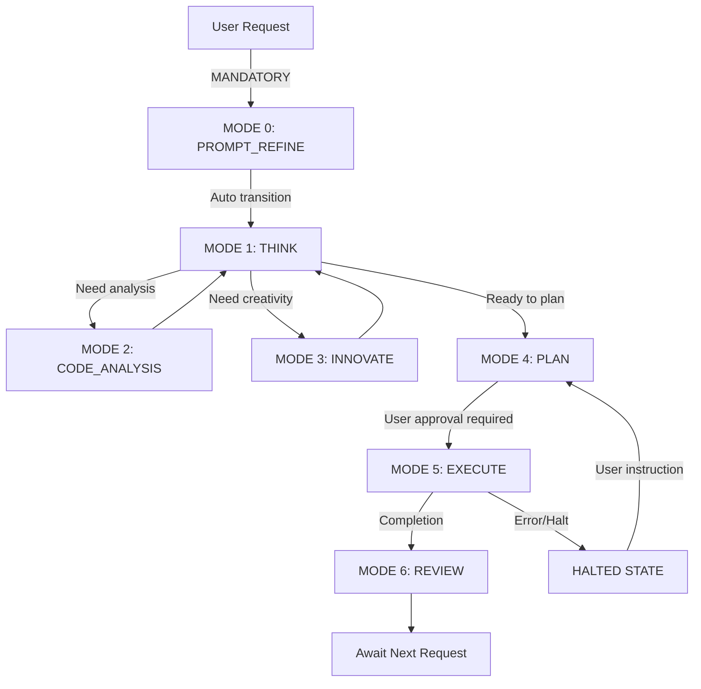
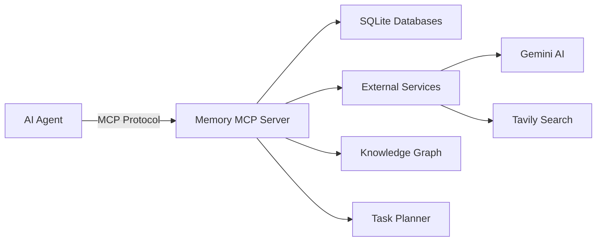

# 🧠 Memory MCP Server - Orchestrator

<div align="center">


[](https://opensource.org/licenses/MIT)
[](https://nodejs.org/)
[](https://www.typescriptlang.org/)

**🚀 Your AI Agent's Persistent Brain - A Comprehensive Memory & Task Management System**

[Overview](#-overview) • [Features](#-features) • [Installation](#-installation) • [Configuration](#️-configuration) • [Workflow](#-the-ai-driver-understanding-workflowmd) • [Tools](#️-available-tools) • [Architecture](#️-architecture) • [Development](#-development)

</div>

---

## 📋 Table of Contents

- [🌟 Overview](#-overview)
- [✨ Features](#-features)
- [🚀 Installation](#-installation)
- [⚙️ Configuration](#️-configuration)
- [🎮 The AI Driver: Understanding workflow.md](#-the-ai-driver-understanding-workflowmd)
- [🛠️ Available Tools](#️-available-tools)
- [🏗️ Architecture](#️-architecture)
- [💻 Development](#-development)
- [📚 Documentation](#-documentation)
- [🤝 Contributing](#-contributing)
- [📄 License](#-license)

---

## 🌟 Overview

The **Memory MCP Server (Orchestrator)** is a powerful Model Context Protocol (MCP) server that provides AI agents with persistent memory, advanced task planning, and comprehensive knowledge management capabilities. Built with TypeScript and SQLite, it transforms your AI agents from stateless assistants into intelligent systems with long-term memory and structured workflows.

### 🚨 The AI Driver (`workflow.md`)

**The `workflow.md` file is the most critical component of this system.** It's not optional documentation; it's the operational manual that turns this server into an intelligent agent. Your AI agent **must** load `workflow.md` into its system prompt to function correctly.

- 🎯 **Defines 7 Operational Modes**: Guides the agent from prompt refinement to task execution and review.
- 🛡️ **Enforces Safety Protocols**: Prevents unauthorized actions and ensures user approval.
- 📋 **Structures Workflows**: Guarantees a systematic approach to every task.
- 🔄 **Manages State Transitions**: Controls how the AI moves between different modes.

📖 **[Jump to workflow.md documentation](#-the-ai-driver-understanding-workflowmd)**

### 🚀 Key Capabilities

- **🧠 Persistent Memory**: Never lose context between sessions
- **📊 Structured Planning**: Break complex tasks into manageable steps
- **🔍 Knowledge Graph**: Create, query, manage, and infer relationships between entities with a powerful dual-backend (SQLite/JSONL) system.
- **🤖 AI-Enhanced**: Leverage Gemini AI for intelligent task suggestions
- **🏗️ Automated Codebase Analysis**: Automatically parse various languages (TS/JS, Python, PHP, etc.) to build a comprehensive knowledge graph of your codebase.
- **💡 Semantic Search**: Perform vector-based semantic search across your code and documentation for powerful context retrieval.
- **📈 Performance & Correction Tracking**: Monitor success metrics and log corrections to learn and improve over time.

---

## ✨ Features

### 💾 Memory Management
- **Conversation History**: Track multi-turn dialogues with full context
- **Dynamic Context Storage**: Version-controlled storage for agent state, preferences, and parameters
- **Knowledge Graph**: Create, query, manage, and infer relationships between entities with a powerful dual-backend (SQLite/JSONL) system.
- **Vector Embeddings**: Generate embeddings for code and documentation for advanced semantic search.

### 📝 Task & Planning System
- **AI-Powered Planning**: Generate comprehensive plans from refined prompts
- **Hierarchical Tasks**: Support for tasks, subtasks, and dependencies
- **Progress Tracking**: Real-time monitoring of task execution
- **Review System**: Built-in task and plan review mechanisms

### 🤖 AI Integration
- **Google Gemini Integration**:
  - Prompt refinement and structuring
  - Context summarization
  - Entity extraction
  - Code analysis
  - Task suggestions
- **Tavily Web Search**: Advanced web search capabilities
- **Semantic Search**: Vector-based content retrieval

### 🛡️ Reliability & Compliance
- **Data Validation**: JSON schema validation for all inputs
- **Comprehensive Logging**: Track all operations and errors
- **Backup & Restore**: Full database backup capabilities
- **MCP Compliant**: Seamless integration with MCP-compatible clients

---

## 🚀 Installation

### Prerequisites

<div align="center">

| Requirement | Version | Required |
|------------|---------|----------|
| Node.js | 18.x or higher | ✅ |
| npm | Latest | ✅ |
| Git | Any | ✅ |

</div>

### Step-by-Step Installation

```bash
# 1. Clone the repository
git clone https://github.com/yourusername/memory-mcp-server.git
cd memory-mcp-server

# 2. Install dependencies
npm install

# 3. Build the project
npm run build

# 4. Verify installation
npm test
```

### 🎯 Quick Start for AI Agents

```bash
# CRITICAL STEP: Load the AI Driver
# Your AI agent MUST load the workflow.md file as part of its system prompt
# This file contains the operational protocols that make the system work

# Example for loading in your AI agent:
# 1. Read the workflow.md file
# 2. Include it in your system prompt or rules
# 3. Follow the 7-mode operational structure
```

### 🐳 Docker Installation (Alternative)

```dockerfile
# Coming soon - Docker support planned
```

---

## ⚙️ Configuration

### 🔑 API Keys Setup

The server requires API keys for external services. These should be configured in your MCP client settings.

<div align="center">

| Service | Environment Variable | Required | Get API Key |
|---------|---------------------|----------|-------------|
| Google Gemini | `GEMINI_API_KEY` | ✅ | [Get Key](https://makersuite.google.com/app/apikey) |
| Tavily Search | `TAVILY_API_KEY` | ✅ | [Get Key](https://tavily.com/) |

</div>

### 📝 MCP Client Configuration

#### For VS Code Cline Extension

1.  **Locate the settings file**:
    -   **Windows**: `%APPDATA%\Code\User\globalStorage\saoudrizwan.claude-dev\settings\cline_mcp_settings.json`
    -   **macOS**: `~/Library/Application Support/Code/User/globalStorage/saoudrizwan.claude-dev/settings/cline_mcp_settings.json`
    -   **Linux**: `~/.config/Code/User/globalStorage/saoudrizwan.claude-dev/settings/cline_mcp_settings.json`

2.  **Add the server configuration**:

```json
{
  "memory-mcp-server": {
    "disabled": false,
    "autoApprove": [],
    "timeout": 120,
    "transportType": "stdio",
    "command": "node",
    "args": [
      "/absolute/path/to/memory-mcp-server/build/index.js"
    ],
    "env": {
      "GEMINI_API_KEY": "your-gemini-api-key-here",
      "TAVILY_API_KEY": "your-tavily-api-key-here"
    }
  }
}
```

> ⚠️ **Important**: Replace `/absolute/path/to/memory-mcp-server/` with the actual path where you cloned the repository.

#### For Other MCP Clients

Adapt the configuration format according to your client's requirements. The key parameters are:
-   **Command**: `node`
-   **Arguments**: `["path/to/build/index.js"]`
-   **Transport**: `stdio`
-   **Environment**: API keys

---

## 🎮 The AI Driver: Understanding workflow.md

The `workflow.md` file is **THE MOST IMPORTANT COMPONENT** of this system. It's not just documentation - it's the operational manual that AI agents must follow to use this server effectively.

### 📋 The 7 Operational Modes

<div align="center">

| Mode | Purpose | Key Responsibility |
|------|---------|-------------------|
| **MODE 0: PROMPT_REFINE** | 🎯 Entry point for ALL tasks | Disambiguates requests, checks past errors, creates structured goals |
| **MODE 1: THINK** | 🧠 Analysis & Strategy | Builds mental model, gathers information, forms strategy |
| **MODE 2: CODE_ANALYSIS** | 🔍 Deep Code Examination | Analyzes code structure, dependencies, quality |
| **MODE 3: INNOVATE** | 💡 Creative Problem Solving | Generates novel solutions, breaks through impasses |
| **MODE 4: PLAN** | 📋 Detailed Planning | Creates step-by-step execution plans with AI assistance |
| **MODE 5: EXECUTE** | ⚡ Controlled Action | Implements approved plans with comprehensive logging |
| **MODE 6: REVIEW** | ✅ Validation & Learning | Validates outcomes, synthesizes lessons learned |

</div>

### 🔄 Workflow State Machine



### 🛡️ Critical Safety Rules

1.  **No Unauthorized Actions**: The agent CANNOT modify files or execute commands without an approved plan
2.  **Mandatory Mode Declaration**: Every response MUST start with `[MODE: MODE_NAME]`
3.  **Tool-Centric Operations**: All significant actions MUST use official tools
4.  **No Post-Task Solicitation**: Agent must NOT ask "what's next?" after completing tasks

### 🚀 How to Use workflow.md

**For AI Agents:**
1.  Load `workflow.md` into your system prompt or rules
2.  Follow the mode progression strictly
3.  Use only the tools allowed in each mode
4.  Respect user authorization requirements

**For Developers:**
1.  Review `workflow.md` to understand the intended agent behavior
2.  Ensure your prompts align with the workflow structure
3.  Monitor agent compliance with the protocols

> ⚠️ **Warning**: AI agents may not always follow these rules perfectly. The workflow.md provides guidelines, not guarantees. Monitor agent behavior and provide corrections as needed.

---

## 🛠️ Available Tools

The server provides **65+ tools** organized into categories:

### 📚 Memory & Context Tools

<details>
<summary><b>Conversation Management (4 tools)</b></summary>

-   `store_conversation_message` - Store messages in conversation history
-   `get_conversation_history` - Retrieve past conversations
-   `search_conversation_by_keywords` - Search conversations by keywords
-   `summarize_conversation` - AI-powered conversation summarization

</details>

<details>
<summary><b>Context Management (9 tools)</b></summary>

-   `store_context` - Store dynamic contextual data
-   `get_context` - Retrieve stored context
-   `get_all_contexts` - Get all contexts for an agent
-   `search_context_by_keywords` - Keyword search in contexts
-   `prune_old_context` - Clean up old context entries
-   `summarize_context` - AI summarization of context
-   `extract_entities` - Extract entities from context
-   `semantic_search_context` - Vector-based semantic search

</details>

### 📋 Planning & Task Tools

<details>
<summary><b>Plan Management (15 tools)</b></summary>

-   `create_task_plan` - Create plans (manual or AI-generated)
-   `get_task_plan_details` - Get detailed plan information
-   `list_task_plans` - List all plans
-   `update_task_plan_status` - Update plan status
-   `delete_task_plan` - Remove plans
-   `ai_analyze_plan` - AI analysis of plan quality
-   `ai_suggest_subtasks` - AI-generated subtask suggestions
-   `ai_suggest_task_details` - AI-enhanced task details
-   `ai_summarize_task_progress` - AI progress summaries

</details>

### 🔍 Knowledge & Attribution Tools

<details>
<summary><b>Knowledge Graph (9 operations)</b></summary>

-   `knowledge_graph_memory` - Comprehensive KG operations
    -   Create/read/update/delete entities
    -   Manage relationships
    -   Add observations
    -   Natural language queries
    -   Infer relationships
    -   Generate visualizations

</details>

### 📊 Logging & Performance Tools

<details>
<summary><b>Comprehensive Logging (23 tools)</b></summary>

-   Tool execution logging
-   Task progress tracking
-   Error logging and management
-   Correction tracking
-   Success metrics
-   Review logs (task and plan level)

</details>

### 🔧 Utility & Integration Tools

<details>
<summary><b>Git Operations (16 tools)</b></summary>

-   Complete Git workflow support
-   Clone, pull, push, commit
-   Branch management
-   Stash operations
-   Remote management

</details>

<details>
<summary><b>External Services (5 tools)</b></summary>

-   `tavily_web_search` - Advanced web search
-   `ask_gemini` - Direct Gemini AI queries
-   `analyze_code_file_with_gemini` - AI code analysis
-   `refine_user_prompt` - AI prompt enhancement
-   `ingest_codebase_embeddings` - Vector embedding generation

</details>

---

## 🏗️ Architecture

### 📁 Project Structure

```
memory-mcp-server/
├── 📂 src/
│   ├── 📂 database/          # Database schemas and managers
│   │   ├── 📂 managers/      # Entity-specific managers
│   │   ├── 📂 services/      # Business logic services
│   │   ├── schema.sql        # Main database schema
│   │   └── vector_store_schema.sql
│   ├── 📂 tools/             # MCP tool implementations
│   │   ├── conversation_tools.ts
│   │   ├── plan_management_tools.ts
│   │   ├── ai_task_enhancement_tools.ts
│   │   └── ... (60+ tool files)
│   ├── 📂 utils/             # Utility functions
│   ├── 📂 types/             # TypeScript definitions
│   └── index.ts              # Main entry point
├── 📂 docs/                  # Documentation
├── 📄 workflow.md            # Agent workflow rules
├── 📄 package.json           # Dependencies
└── 📄 README.md              # This file
```

### 🗄️ Database Schema

The server uses two SQLite databases:

1.  **Main Database** (`memory.db`):
    -   Conversation history
    -   Context information
    -   Task plans and progress
    -   Knowledge graph
    -   Logs and metrics

2.  **Vector Store** (`vector_store.db`):
    -   Code embeddings
    -   Semantic search indices

### 🔄 Data Flow



---

## 💻 Development

### 🛠️ Development Setup

```bash
# Install dependencies
npm install

# Run in development mode with auto-rebuild
npm run watch

# Run tests
npm test

# Start the MCP Inspector for debugging
npm run inspector
```

### 🧪 Testing

The project uses Jest for testing:

```bash
# Run all tests
npm test

# Run tests in watch mode
npm test -- --watch

# Run tests with coverage
npm test -- --coverage
```

### 🐛 Debugging

Since MCP servers communicate over stdio, use the MCP Inspector:

```bash
npm run inspector
# Opens a browser-based debugging interface
```

### 📝 Code Style

-   **Language**: TypeScript 5.3+
-   **Style**: ESLint configuration included
-   **Format**: Prettier compatible

---

## 📚 Documentation

### 📖 Key Documents

-   **🚨 [Workflow Rules](workflow.md)** - **CRITICAL: The AI Driver that makes everything work!**
    -   Defines the 7 operational modes
    -   Enforces safety protocols
    -   Structures agent behavior
    -   **MUST be loaded into AI agent's system prompt**
-   **[API Documentation](docs/api_documentation.md)** - Detailed tool schemas and parameters
-   **[Implementation Notes](docs/implementation_notes.md)** - Technical details
-   **[Future Implementations](docs/future_implementations.md)** - Roadmap

### 🎯 Quick Start Examples

<details>
<summary><b>Example 1: Creating an AI-Generated Plan</b></summary>

```typescript
// 1. Refine the user prompt
const refinedPrompt = await refine_user_prompt({
  agent_id: "my-agent",
  raw_user_prompt: "Build a REST API for user management"
});

// 2. Create a plan from the refined prompt
const plan = await create_task_plan({
  agent_id: "my-agent",
  refined_prompt_id: refinedPrompt.refined_prompt_id
});

// 3. Get AI suggestions for subtasks
const subtasks = await ai_suggest_subtasks({
  agent_id: "my-agent",
  plan_id: plan.plan_id,
  parent_task_id: plan.task_ids[0]
});
```

</details>

<details>
<summary><b>Example 2: Knowledge Graph Operations</b></summary>

```typescript
// Create entities
await knowledge_graph_memory({
  agent_id: "my-agent",
  operation: "create_entities",
  entities: [
    {
      name: "UserController",
      entityType: "class",
      observations: ["Handles user CRUD operations"]
    }
  ]
});

// Query with natural language
const results = await kg_nl_query({
  agent_id: "my-agent",
  query: "What classes handle user operations?"
});
```

</details>

---

## 🤝 Contributing

We welcome contributions! Please see our [Contributing Guidelines](CONTRIBUTING.md) for details.

### 🐛 Reporting Issues

1.  Check existing issues first
2.  Use issue templates
3.  Provide reproduction steps
4.  Include error logs

### 🔧 Pull Requests

1.  Fork the repository
2.  Create a feature branch
3.  Add tests for new features
4.  Ensure all tests pass
5.  Submit PR with clear description

---

## 📄 License

This project is licensed under the MIT License - see the [LICENSE](LICENSE.md) file for details.

---

<div align="center">

**Built with ❤️ for AI Agents**

[⬆ Back to Top](#-memory-mcp-server---orchestrator)

</div>