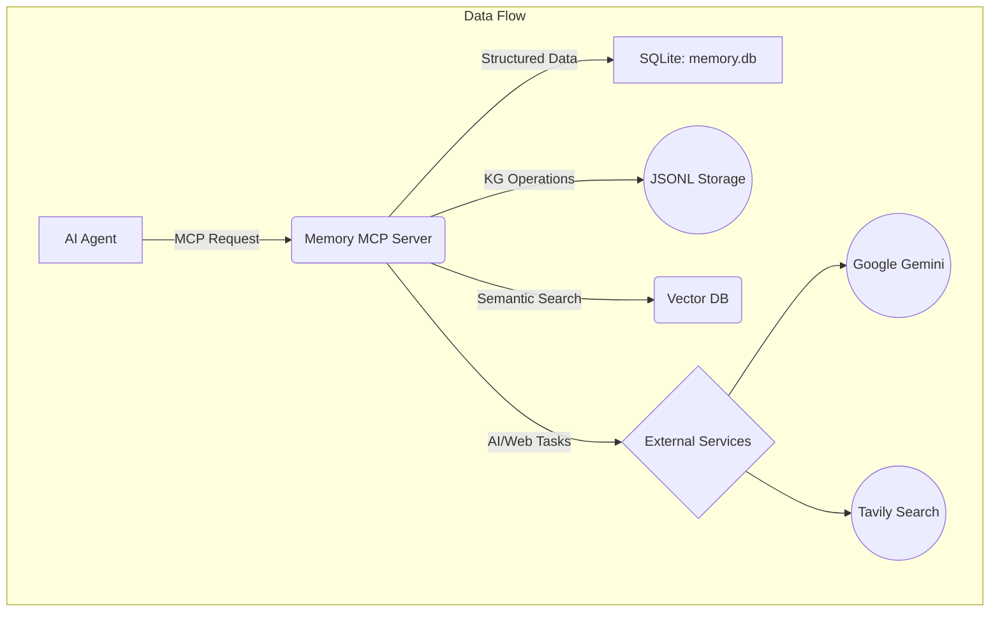

<!-- file_path: README.md -->
# 🧠 Memory MCP Server - Orchestrator

<div align="center">


[](https://opensource.org/licenses/MIT)
[](https://nodejs.org/)
[](https://www.typescriptlang.org/)

**🚀 Your AI Agent's Persistent Brain: A powerful backend for memory, planning, and codebase understanding.**

[Overview](#-overview) • [Features](#-features) • [Installation](#-installation) • [Configuration](#️-configuration) • [Creating Workflows](#-creating-workflows) • [Available Tools](#-available-tools) • [Architecture](#️-architecture) • [Development](#-development)

</div>

---

## 📋 Table of Contents

- [🌟 Overview](#-overview)
- [✨ Features](#-features)
- [🚀 Installation](#-installation)
- [⚙️ Configuration](#️-configuration)
- [💡 Creating Workflows](#-creating-workflows)
- [🛠️ Available Tools](#-available-tools)
  - [💬 Conversation Management](#-conversation-management-8-tools)
  - [🧠 Context & Reference Keys](#-context--reference-keys-6-tools)
  - [📊 Plan & Task Management](#-plan--task-management-11-tools)
  - [📝 Subtask Management](#-subtask-management-4-tools)
  - [💡 Knowledge Graph](#-knowledge-graph-6-tools)
  - [🔍 Codebase Embeddings](#-codebase-embeddings-3-tools)
  - [🤖 AI-Powered Plan/Task Enhancements](#-ai-powered-plantask-enhancements-3-tools)
  - [💬 Prompt Refinement](#-prompt-refinement-1-tool)
  - [🤖 AI Queries](#-ai-queries-1-tool)
  - [🌐 Web Search](#-web-search-1-tool)
  - [🔧 Database Utilities](#-database-utilities-3-tools)
  - [📖 Tool Introspection](#-tool-introspection-1-tool)
- [🏗️ Architecture](#️-architecture)
- [💻 Development](#-development)
- [🤝 Contributing](#-contributing)
- [📄 License](#-license)

---

## 🌟 Overview

The **Memory MCP Server (Orchestrator)** is a powerful Model Context Protocol (MCP) server that provides AI agents with persistent memory, advanced task planning, and deep codebase intelligence. Built with TypeScript, it uses a hybrid storage system—SQLite for structured data, a portable JSONL format for the knowledge graph, and a dedicated vector store for semantic search—to transform your AI agents from stateless assistants into intelligent systems with long-term memory and context-aware capabilities.

Instead of enforcing a rigid workflow, this server provides a rich toolkit of **45+ tools**. The true power is unlocked when you, the developer, define a workflow in your AI agent's system prompt to orchestrate these tools for complex tasks like code generation, refactoring, and analysis.

### 🚀 Key Capabilities

-   **🧠 Persistent Memory**: Never lose context with collaborative, multi-turn conversation sessions.
-   **📊 AI-Powered Planning**: Generate comprehensive, multi-step project plans from a single high-level goal.
-   **💡 Intelligent Codebase Understanding**:
    -   **Portable Knowledge Graph (JSONL):** Build a version-controllable, human-readable graph of your codebase.
    -   **Multi-Language Parsing:** Automatically parse TS/JS, Python, PHP, HTML, CSS, and more to understand code structure.
    -   **Semantic Search:** Perform vector-based search to find conceptually similar code, not just keyword matches.
-   **📈 Comprehensive Logging**: Track every tool execution, error, and correction to monitor and improve agent performance.
-   **🤖 Integrated AI Services**: Natively leverages Google Gemini for planning, analysis, and natural language queries, and Tavily for advanced web search.

---

## ✨ Features

### 🧠 Memory & Context Management
-   **Collaborative Conversation Sessions**: Track multi-turn dialogues with support for multiple participants.
-   **Versioned Context Storage**: Store and retrieve dynamic data like agent state, preferences, and parameters with version control.

### 🏗️ Advanced Task & Project Planning
-   **AI-Powered Plan Generation**: Use tools like `create_task_plan` with a `goal_description` to have Gemini automatically generate a full, multi-step project plan.
-   **Hierarchical Tasks**: Full support for plans, tasks, and subtasks to break down complex problems.
-   **AI-Enhanced Task Details**: Use AI to suggest detailed descriptions, success criteria, dependencies, and more for any task.
-   **Progress & Execution Logging**: A suite of logging tools tracks every step, tool call, and error, providing a full audit trail of the agent's work.

### 💡 Intelligent Codebase Understanding
-   **Portable Knowledge Graph (JSONL backend)**:
    -   Store entities (files, classes, functions) and their relationships in a human-readable, Git-friendly format.
    -   Query the graph using natural language (e.g., "What functions in `auth_service.ts` call the database?").
    -   AI-powered relation inference to discover new connections in your code.
-   **Automated Multi-Language Parsing**:
    -   Tools like `ingest_codebase_structure` and `ingest_file_code_entities` automatically parse your project.
    -   Supports TypeScript/JavaScript, Python, PHP, HTML, CSS, Markdown, and more.
-   **Semantic Search & Embeddings**:
    -   Generate vector embeddings for your code with `ingest_codebase_embeddings`.
    -   Use `query_codebase_embeddings` to find code snippets based on conceptual similarity, not just keywords.

### 🤖 Integrated AI Services
-   **Google Gemini**: Deeply integrated for planning, summarization, natural language queries, code analysis, and task suggestions.
-   **Tavily**: Provides advanced, AI-optimized web search capabilities to ground your agent in real-world information.

### 🛡️ Robust & Reliable
-   **Comprehensive Logging Suite**: Dedicated tools for logging tool executions, task progress, errors, and corrections.
-   **Data Validation**: All tool inputs are validated against a JSON schema to ensure data integrity.
-   **Database Utilities**: Includes tools for backing up and restoring the primary SQLite database.

---

## 🚀 Installation

### Prerequisites

| Requirement    | Version        |
| -------------- | -------------- |
| **Node.js**    | 18.x or higher |
| **npm**        | Latest         |
| **Git**        | Any            |

### Step-by-Step Installation

```bash
# 1. Clone the repository
git clone https://github.com/yourusername/memory-mcp-server.git
cd memory-mcp-server

# 2. Install dependencies
npm install

# 3. Build the project
npm run build

# 4. Verify the build by running tests
npm test
```

---

## ⚙️ Configuration

### API Keys Setup

The server requires API keys for external services. These are best configured in your MCP client's settings file to avoid exposing them in your shell environment. For Google Gemini, you can provide multiple API keys (e.g., from different projects or for failover/load balancing) by appending an underscore and a number (e.g., `GEMINI_API_KEY_2`, `GOOGLE_API_KEY_3`). The server will automatically use these in a round-robin fashion.

| Service         | Environment Variable       | Required | Get API Key                                        |
| --------------- | -------------------------- | -------- | -------------------------------------------------- |
| Google Gemini   | `GEMINI_API_KEY`           | ✅       | [Get Key](https://makersuite.google.com/app/apikey) |
|                 | `GEMINI_API_KEY_2`, etc.   | 🔀 (Optional) |                                                    |
|                 | `GOOGLE_API_KEY`           | ➡️ (Alias) |                                                    |
|                 | `GOOGLE_API_KEY_2`, etc.   | 🔀 (Optional) |                                                    |
| Tavily Search   | `TAVILY_API_KEY`           | ✅       | [Get Key](https://tavily.com/)                      |

### MCP Client Configuration (VS Code Client Example)

1.  **Locate the settings file**:
    -   **Windows**: `%APPDATA%\Code\User\globalStorage\saoudrizwan.claude-dev\settings\cline_mcp_settings.json`
    -   **macOS**: `~/Library/Application Support/Code/User/globalStorage/saoudrizwan.claude-dev/settings/cline_mcp_settings.json`
    -   **Linux**: `~/.config/Code/User/globalStorage/saoudrizwan.claude-dev/settings/cline_mcp_settings.json`

2.  **Add the server configuration**:

```json
{
  "memory-mcp-server": {
    "disabled": false,
    "autoApprove": [],
    "timeout": 120,
    "transportType": "stdio",
    "command": "node",
    "args": [
      "/absolute/path/to/memory-mcp-server/build/index.js"
    ],
    "env": {
      "GEMINI_API_KEY": "your-primary-gemini-api-key",
      "GEMINI_API_KEY_2": "your-secondary-gemini-api-key",
      "GOOGLE_API_KEY": "another-gemini-key-alias",
      "TAVILY_API_KEY": "your-tavily-api-key-here"
    }
  }
}
```

> ⚠️ **Important**: Replace `/absolute/path/to/memory-mcp-server/` with the actual absolute path where you cloned the repository.

---

## 💡 Creating Workflows

This server does not enforce a single, rigid workflow. Instead, it provides a comprehensive suite of tools that you can orchestrate to create powerful, custom workflows tailored to your needs. The best way to do this is by defining a sequence of actions in your AI agent's system prompt or operational instructions.

By combining tools, you can guide your agent through complex processes like codebase analysis, feature implementation, or large-scale refactoring.

### Example Workflow: Implementing a New Feature

An agent could be instructed to follow these general steps using the available tools:

1.  **Understand the Goal**: Use `ask_gemini` with `execution_mode: 'plan_generation'` on the user's feature request. This refines the prompt and generates an initial, structured plan (with a `refined_prompt_id`).
2.  **Initialize Plan**: Use `create_task_plan` with the `refined_prompt_id` from the previous step.
3.  **Analyze the Codebase**: Use `ingest_codebase_structure` on the project directory to build a high-level map of the code.
4.  **Deep-Dive Analysis**: Use `ingest_file_code_entities` on the most relevant files identified in the plan to understand their specific functions and classes.
5.  **Execute the Plan**: For each task in the plan:
    -   Use `get_task_details` to understand the current step.
    -   Use `ai_suggest_subtasks` to break down complex coding tasks.
    -   Execute necessary actions (e.g., modifying files).
    -   Log progress with `log_task_progress`.
    -   Log any tool calls with `log_tool_execution`.
6.  **Review and Adapt**: Periodically use `ai_analyze_plan` to check for coherence and `ai_summarize_task_progress` to get a high-level status, adapting the plan as needed.

This flexible approach allows you to create sophisticated agent behaviors by simply defining the high-level strategy.

---

## 🛠️ Available Tools

The server provides a rich set of **45+ tools** to manage memory, planning, codebase analysis, and more. They are organized into logical categories.

<details>
<summary><b>💬 Conversation Management (8 tools)</b></summary>

-   `create_conversation_session`
-   `end_conversation_session`
-   `store_conversation_messages`
-   `get_conversation_session`
-   `get_conversation_sessions`
-   `get_conversation_messages`
-   `add_participant_to_session`
-   `get_session_participants`

</details>

<details>
<summary><b>🧠 Context & Reference Keys (6 tools)</b></summary>

-   `store_context`
-   `get_context`
-   `search_context_by_keywords`
-   `prune_old_context`
-   `add_reference_key`
-   `get_reference_keys`

</details>

<details>
<summary><b>📊 Plan & Task Management (11 tools)</b></summary>

-   `create_task_plan`
-   `get_plan`
-   `list_task_plans`
-   `update_task_plan_status`
-   `delete_task_plans`
-   `get_plan_tasks`
-   `get_task_details`
-   `update_task_details`
-   `add_task_to_plan`
-   `delete_tasks`
-   `update_task`

</details>

<details>
<summary><b>📝 Subtask Management (4 tools)</b></summary>

-   `add_subtask_to_plan`
-   `get_subtasks`
-   `update_subtask_details`
-   `delete_subtasks`

</details>

<details>
<summary><b>💡 Knowledge Graph (6 tools)</b></summary>

-   **Core Operations**: `knowledge_graph_memory` (a multi-operation tool for CRUD, observations, etc.).
-   **Intelligent Queries**: `kg_nl_query` (natural language), `kg_infer_relations`, `kg_visualize`.
-   **Codebase Ingestion**: `ingest_codebase_structure`, `ingest_file_code_entities`.

</details>

<details>
<summary><b>🔍 Codebase Embeddings (3 tools)</b></summary>

-   `ingest_codebase_embeddings`
-   `query_codebase_embeddings`
-   `clean_up_embeddings`

</details>

<details>
<summary><b>🤖 AI-Powered Plan/Task Enhancements (3 tools)</b></summary>

-   `ai_suggest_subtasks`
-   `ai_suggest_task_details`
-   `ai_analyze_plan`

</details>

<details>
<summary><b>💬 Prompt Refinement (1 tool)</b></summary>

-   `get_refined_prompt` (Retrieves a previously refined prompt by ID. Note: `ask_gemini` with `execution_mode: 'plan_generation'` is used to *generate* a refined prompt.)

</details>

<details>
<summary><b>🤖 AI Queries (1 tool)</b></summary>

-   `ask_gemini` (A versatile tool for generative answers, RAG, iterative search, and plan generation.)

</details>

<details>
<summary><b>🌐 Web Search (1 tool)</b></summary>

-   `tavily_web_search`

</details>

<details>
<summary><b>🔧 Database Utilities (3 tools)</b></summary>

-   `export_data_to_csv`
-   `backup_database`
-   `restore_database`

</details>

<details>
<summary><b>📖 Tool Introspection (1 tool)</b></summary>

-   `list_tools`

</details>

---

## 🏗️ Architecture

### 📁 Project Structure

```
memory-mcp-server/
├── 📂 src/
│   ├── 📂 database/        # Database schemas, services, and managers
│   │   ├── 📂 managers/    # Logic for managing specific data models
│   │   ├── 📂 parsers/     # Language parsers for codebase introspection
│   │   ├── 📂 services/    # Business logic (Gemini, Embeddings, etc.)
│   │   └── 📂 storage/     # Low-level storage (JSONL, Indexing)
│   ├── 📂 tools/           # MCP tool definitions and handlers
│   ├── 📂 types/           # Core TypeScript type definitions
│   └── index.ts            # Main server entry point
├── 📂 knowledge_graphs/    # Default directory for JSONL knowledge graph data
├── 📄 memory.db             # Main SQLite database
├── 📄 vector_store.db       # SQLite database for vector embeddings
└── 📄 README.md             # This file
```

### 🗄️ Data Storage

The server uses a hybrid storage approach for optimal performance and portability:

1.  **`memory.db` (SQLite)**: Stores all structured, relational data, including conversation history, context, plans, tasks, and logs.
2.  **`knowledge_graphs/` (JSONL)**: The knowledge graph is stored in a directory of JSONL (JSON Lines) files. This makes the AI's "knowledge" human-readable, portable, and easily version-controlled with Git.
3.  **`vector_store.db` (SQLite + `sqlite-vec`)**: A dedicated database that stores vector embeddings for code, enabling high-performance semantic search.

### 🔄 Data Flow



---

## 💻 Development

### 🛠️ Development Setup

```bash
# Install all dependencies
npm install

# Run in development mode with auto-rebuild on file changes
npm run watch

# Run the test suite
npm test
```

### 🧪 Testing

The project uses Jest for unit and integration testing.

```bash
# Run all tests once
npm test

# Run tests in watch mode, re-running on changes
npm test -- --watch

# Generate a code coverage report
npm test -- --coverage
```

### 🐛 Debugging

Since MCP servers communicate over stdio, use the MCP Inspector for debugging requests and responses in a web-based UI.

```bash
npm run inspector
# This will open a browser-based debugging interface.
```

---

## 🤝 Contributing

We welcome contributions! Please fork the repository and submit a pull request with your changes. Ensure that new features are covered by tests and that all existing tests pass.

---

## 📄 License

This project is licensed under the MIT License - see the [LICENSE](LICENSE.md) file for details.

---

<div align="center">

**Built with ❤️ for Intelligent AI Agents**

[⬆ Back to Top](#-memory-mcp-server---orchestrator)

</div>