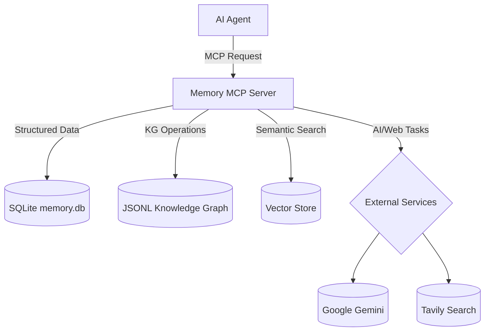

# 🧠 Memory MCP Server — Orchestrator

<div align="center">


[](https://opensource.org/licenses/MIT)
[](https://nodejs.org/)
[](https://www.typescriptlang.org/)

<h3>
🚀 Your AI Agent's Persistent Brain: <br>
A vivid backend for memory, task planning, and codebase intelligence.
</h3>

</div>

---

## 📋 Table of Contents

- [🌟 Overview](#-overview)
- [✨ Features](#-features)
- [🚀 Installation](#-installation)
- [⚙️ Configuration](#️-configuration)
- [🛠️ Available Tools](#-available-tools)
- [🏗️ Architecture](#️-architecture)
- [💻 Development](#-development)
- [🤝 Contributing](#-contributing)
- [📄 License](#-license)

---

## 🌟 Overview

Memory MCP Server (Orchestrator) is a state-of-the-art backend that transforms AI agents into persistent, context-aware, and deeply code-literate collaborators. With rich, multi-turn memory, AI-powered planning, and semantic understanding of your codebase, it unlocks intelligent workflows for everything from code review to project management.

---

## ✨ Features

- **🧠 Persistent Memory:** Multi-user conversation sessions, versioned context, and reference keys.
- **📊 Project & Task Planning:** Manage plans, tasks, and subtasks; boost with AI-powered plan/task generation and analysis.
- **💡 Knowledge Graph:** Portable, human-readable codebase graph (JSONL); store and query entities & relationships.
- **🔍 Semantic Code Search:** Embed and search code for conceptual matches, not just keywords.
- **🤖 Integrated AI Services:** Google Gemini for planning, summarization, and code analysis; Tavily for grounded web search.
- **🛡️ Data Validation & Utilities:** Input schema validation, robust error handling, and database backup/restore tools.

---

## 🚀 Installation

### Prerequisites

| Requirement    | Version        |
| -------------- | -------------- |
| **Node.js**    | 18.x or higher |
| **npm**        | Latest         |
| **Git**        | Any            |

### Installation Steps

```bash
git clone https://github.com/rashee1997/orchestrator.git
cd orchestrator
npm install
npm run build
```

---

## ⚙️ Configuration

### API Keys Setup

Set external service keys (Gemini/Tavily) in your MCP client’s environment or as system environment variables.

| Service         | Environment Variable       | Required | Get API Key                                        |
| --------------- | -------------------------- | -------- | -------------------------------------------------- |
| Google Gemini   | `GEMINI_API_KEY`           | ✅       | [Get Key](https://makersuite.google.com/app/apikey) |
|                 | `GEMINI_API_KEY_2`, etc.   | 🔀 (Optional) |                                                    |
| Tavily Search   | `TAVILY_API_KEY`           | ✅       | [Get Key](https://tavily.com/)                      |

### MCP Client Configuration (VS Code Client Example)
_Keep this setup for smooth local development:_

1. **Locate the settings file**:
    - **Windows**: `%APPDATA%\Code\User\globalStorage\saoudrizwan.claude-dev\settings\cline_mcp_settings.json`
    - **macOS**: `~/Library/Application Support/Code/User/globalStorage/saoudrizwan.claude-dev/settings/cline_mcp_settings.json`
    - **Linux**: `~/.config/Code/User/globalStorage/saoudrizwan.claude-dev/settings/cline_mcp_settings.json`

2. **Add the server configuration**:

```json
{
  "memory-mcp-server": {
    "disabled": false,
    "autoApprove": [],
    "timeout": 120,
    "transportType": "stdio",
    "command": "node",
    "args": [
      "/absolute/path/to/memory-mcp-server/build/index.js"
    ],
    "env": {
      "GEMINI_API_KEY": "your-primary-gemini-api-key",
      "TAVILY_API_KEY": "your-tavily-api-key-here"
    }
  }
}
```
> ⚡️ Replace `/absolute/path/to/memory-mcp-server/` with your actual path.

---

## 🛠️ Available Tools

<details>
<summary><b>💬 Conversation Management</b></summary>

- create_conversation_session
- end_conversation_session
- store_conversation_messages
- get_conversation_session
- get_conversation_sessions
- get_conversation_messages
- add_participant_to_session
- get_session_participants

</details>

<details>
<summary><b>📊 Plan & Task Management</b></summary>

- create_task_plan
- get_task_plan
- update_task_plan
- delete_task_plan
- list_task_plans
- create_task
- get_task
- update_task
- delete_task
- list_tasks
- assign_task

</details>

<details>
<summary><b>📝 Subtask Management</b></summary>

- create_subtask
- get_subtask
- update_subtask
- list_subtasks

</details>

<details>
<summary><b>💡 Knowledge Graph</b></summary>

- ingest_codebase_structure
- ingest_file_code_entities
- list_knowledge_graph_entities
- query_knowledge_graph
- update_knowledge_graph_entry
- delete_knowledge_graph_entry

</details>

<details>
<summary><b>🔍 Embeddings & Semantic Search</b></summary>

- ingest_codebase_embeddings
- query_codebase_embeddings
- clean_up_embeddings

</details>

<details>
<summary><b>🤖 AI-Enhanced Planning/Tasks</b></summary>

- ai_suggest_subtasks
- ai_suggest_task_details
- ai_analyze_plan

</details>

<details>
<summary><b>✨ Prompt Refinement & AI</b></summary>

- get_refined_prompt
- ask_gemini

</details>

<details>
<summary><b>🌐 Web Search & Database Utilities</b></summary>

- tavily_web_search
- export_data_to_csv
- backup_database
- restore_database
- list_tools

</details>

---

## 🏗️ Architecture

### Project Structure

```
memory-mcp-server/
├── src/
│   ├── database/        # Database schemas, services, and managers
│   │   ├── managers/    # Logic for managing specific data models
│   │   ├── parsers/     # Language parsers for codebase introspection
│   │   ├── services/    # Business logic (Gemini, Embeddings, etc.)
│   │   └── storage/     # Low-level storage (JSONL, Indexing)
│   ├── tools/           # MCP tool definitions and handlers
│   ├── types/           # Core TypeScript type definitions
│   └── index.ts         # Main server entry point
├── knowledge_graphs/    # JSONL for code graph
├── memory.db            # SQLite main db
├── vector_store.db      # SQLite for embeddings
└── README.md
```

### Data Flow



---

## 💻 Development

```bash
npm install
npm run build    # Compile TypeScript
npm run watch    # Auto-rebuild on changes
npm test         # Run tests
```

- Use `npm run inspector` for a web-based debugging UI.

---

## 🤝 Contributing

We love contributions! Fork, PR, and let’s build the future of intelligent agents together. Ensure you cover new features with tests and keep all existing tests green.

---

## 📄 License

MIT — see [LICENSE](LICENSE.md) for details.

---

<div align="center">

💡 **Built with creativity and care for next-gen AI agents.**

[⬆ Back to Top](#-memory-mcp-server--orchestrator)

</div>