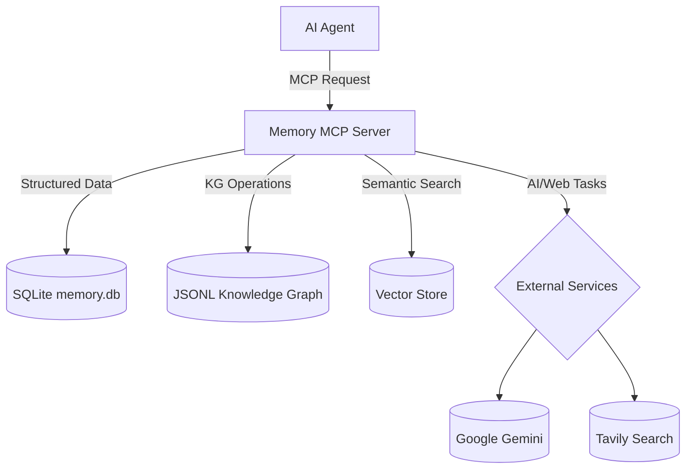

# 🧠 Memory MCP Server — Orchestrator


[](https://opensource.org/licenses/MIT)
[](https://nodejs.org/)
[](https://www.typescriptlang.org/)

**🚀 Your AI Agent's Persistent Brain: A vivid backend for memory, task planning, and codebase intelligence.**

---

## 📋 Table of Contents

- [🌟 Overview](#-overview)
- [✨ Features](#-features)
- [🚀 Installation](#-installation)
- [⚙️ Configuration](#️-configuration)
- [🛠️ Available Tools](#-available-tools)
- [⚡ Example Workflow](#-example-workflow)
- [🏗️ Architecture](#️-architecture)
- [💻 Development](#-development)
- [🤝 Contributing](#-contributing)
- [📄 License](#-license)

---

## 🌟 Overview

Memory MCP Server (Orchestrator) is a state-of-the-art backend that transforms AI agents into persistent, context-aware, and deeply code-literate collaborators. With rich, multi-turn memory, AI-powered planning, and semantic understanding of your codebase, it unlocks intelligent workflows for everything from code review to project management.

---

## ✨ Features

- **Persistent Memory:** Multi-user conversation sessions, versioned context, and reference keys.
- **Project & Task Planning:** Manage plans, tasks, and subtasks; boost with AI-powered plan/task generation and analysis.
- **Knowledge Graph:** Portable, human-readable codebase graph (JSONL); store and query entities & relationships.
- **Semantic Code Search:** Embed and search code for conceptual matches, not just keywords.
- **Integrated AI Services:** Google Gemini for planning, summarization, and code analysis; Tavily for grounded web search.
- **Data Validation & Utilities:** Input schema validation, robust error handling, and database backup/restore tools.

---

## 🚀 Installation

### Prerequisites

| Requirement    | Version        |
| -------------- | -------------- |
| **Node.js**    | 18.x or higher |
| **npm**        | Latest         |
| **Git**        | Any            |

### Installation Steps

```bash
git clone https://github.com/rashee1997/orchestrator.git
cd orchestrator
npm install
npm run build
```

---

## ⚙️ Configuration

### API Keys Setup

The server requires API keys for external services. These are best configured in your MCP client's settings file to avoid exposing them in your shell environment. For Google Gemini, you can provide multiple API keys (e.g., from different projects or for failover/load balancing) by appending an underscore and a number (e.g., `GEMINI_API_KEY_2`, `GOOGLE_API_KEY_3`). The server will automatically use these in a round-robin fashion.

| Service         | Environment Variable       | Required | Get API Key                                        |
| --------------- | -------------------------- | -------- | -------------------------------------------------- |
| Google Gemini   | `GEMINI_API_KEY`           | ✅       | [Get Key](https://makersuite.google.com/app/apikey) |
|                 | `GEMINI_API_KEY_2`, etc.   | 🔀 (Optional) |                                                    |
|                 | `GOOGLE_API_KEY`           | ➡️ (Alias) |                                                    |
|                 | `GOOGLE_API_KEY_2`, etc.   | 🔀 (Optional) |                                                    |
| Tavily Search   | `TAVILY_API_KEY`           | ✅       | [Get Key](https://tavily.com/)                      |

### MCP Client Configuration (VS Code Client Example)

1.  **Locate the settings file**:
    -   **Windows**: `%APPDATA%\Code\User\globalStorage\saoudrizwan.claude-dev\settings\cline_mcp_settings.json`
    -   **macOS**: `~/Library/Application Support/Code/User/globalStorage/saoudrizwan.claude-dev/settings/cline_mcp_settings.json`
    -   **Linux**: `~/.config/Code/User/globalStorage/saoudrizwan.claude-dev/settings/cline_mcp_settings.json`

2.  **Add the server configuration**:

```json
{
  "memory-mcp-server": {
    "disabled": false,
    "autoApprove": [],
    "timeout": 120,
    "transportType": "stdio",
    "command": "node",
    "args": [
      "/absolute/path/to/memory-mcp-server/build/index.js"
    ],
    "env": {
      "GEMINI_API_KEY": "your-primary-gemini-api-key",
      "GEMINI_API_KEY_2": "your-secondary-gemini-api-key",
      "GOOGLE_API_KEY": "another-gemini-key-alias",
      "TAVILY_API_KEY": "your-tavily-api-key-here"
    }
  }
}
```

> Replace `/absolute/path/to/memory-mcp-server/` with your actual path.

---

## 🛠️ Available Tools

- **Conversation Management:** Create, manage, and retrieve conversation sessions and messages for persistent, multi-user dialogue.
    - _Examples: `create_conversation_session`, `get_conversation_messages`_
- **Plan & Task Management:** Organize and update project plans, tasks, and subtasks, assign tasks, and track progress.
    - _Examples: `create_task_plan`, `list_tasks`, `assign_task`_
- **Subtask Management:** Break tasks into subtasks for finer granularity and progress tracking.
    - _Examples: `create_subtask`, `list_subtasks`_
- **Knowledge Graph Tools:** Parse your codebase, build a knowledge graph, and query or update code entities and relationships.
    - _Examples: `ingest_codebase_structure`, `query_knowledge_graph`_
- **Embeddings & Semantic Search:** Generate and query vector embeddings for conceptual code search.
    - _Examples: `ingest_codebase_embeddings`, `query_codebase_embeddings`_
- **AI-Enhanced Planning/Tasks:** Use AI to decompose tasks, suggest details, or analyze plans for coherence and completeness.
    - _Examples: `ai_suggest_subtasks`, `ai_analyze_plan`_
- **Prompt Refinement & AI:** Refine natural language prompts and generate answers with Gemini.
    - _Examples: `get_refined_prompt`, `ask_gemini`_
- **Web Search & Database Utilities:** Integrate grounded results via Tavily, export data, and manage DB backups.
    - _Examples: `tavily_web_search`, `backup_database`, `list_tools`_

---

## ⚡ Example Workflow

Here’s how you might orchestrate a multi-step AI workflow with these tools:

1. **Understand the Goal**: Use `ask_gemini` (with `execution_mode: plan_generation`) to turn a high-level prompt into a structured project plan.
2. **Create the Plan**: Call `create_task_plan` with the refined prompt to initialize a new plan.
3. **Analyze Codebase**: Run `ingest_codebase_structure` to map code files and entities.
4. **Enrich Tasks**: Use `ai_suggest_subtasks` to break complex tasks into actionable subtasks.
5. **Track Progress**: Store and retrieve progress via `get_task`, `update_task`, and related tools.
6. **Search & Context**: Use `query_codebase_embeddings` or `tavily_web_search` as context for tasks or code review.
7. **Audit & Export**: Regularly export data with `export_data_to_csv` or back up the database.

[See the docs/ directory or the [project wiki](https://github.com/rashee1997/orchestrator/wiki) for more workflow recipes and advanced usage.]

---

## 🏗️ Architecture

### Project Structure

```
memory-mcp-server/
├── src/
│   ├── database/        # Database schemas, services, and managers
│   │   ├── managers/    # Logic for managing specific data models
│   │   ├── parsers/     # Language parsers for codebase introspection
│   │   ├── services/    # Business logic (Gemini, Embeddings, etc.)
│   │   └── storage/     # Low-level storage (JSONL, Indexing)
│   ├── tools/           # MCP tool definitions and handlers
│   ├── types/           # Core TypeScript type definitions
│   └── index.ts         # Main server entry point
├── knowledge_graphs/    # JSONL for code graph
├── memory.db            # SQLite main db
├── vector_store.db      # SQLite for embeddings
└── README.md
```

### Data Flow



---

## 💻 Development

```bash
npm install
npm run build    # Compile TypeScript
npm run watch    # Auto-rebuild on changes
npm test         # Run tests
```

- Use `npm run inspector` for a web-based debugging UI.

---

## 🤝 Contributing

We love contributions! Fork, PR, and let’s build the future of intelligent agents together. Ensure you cover new features with tests and keep all existing tests green.

---

## 📄 License

MIT — see [LICENSE](LICENSE.md) for details.

---

_Built with creativity and care for next-gen AI agents._