<div align="center">

# Memory MCP Server — Orchestrator


### 🚀 Your AI Agent's Persistent Brain
**Advanced memory, intelligent orchestration, and semantic codebase understanding for next-generation AI agents**

<div>

[](https://github.com/rashee1997/orchestrator)
[](https://opensource.org/licenses/MIT)
[](https://nodejs.org/)
[](https://www.typescriptlang.org/)

</div>

<div>


</div>

</div>

---

## 📋 Table of Contents

- [🌟 Overview](#-overview)
- [✨ Features](#-features)
- [🚀 Installation](#-installation)
- [⚙️ Configuration](#️-configuration)
- [🛠️ Available Tools](#-available-tools)
- [⚡ Example Workflow](#-example-workflow)
- [🏗️ Architecture](#️-architecture)
- [💻 Development](#-development)
- [🤝 Contributing](#-contributing)
- [📄 License](#-license)

---

## 🌟 Overview

Memory MCP Server (Orchestrator) is a state-of-the-art backend that transforms AI agents into persistent, context-aware, and deeply code-literate collaborators. With rich, multi-turn memory, AI-powered planning, and semantic understanding of your codebase, it unlocks intelligent workflows for everything from code review to project management.

---

## ✨ Features

<div align="center">

### 🎯 **Core Capabilities**

</div>

<table>
<tr>
<td width="50%">

### 🧠 **Advanced Memory & Intelligence**
- 💬 **Persistent Conversations** - Multi-user sessions with threading
- 📋 **Intelligent Task Planning** - AI-powered project decomposition
- 🔍 **Multi-Language Analysis** - TS, JS, Python, PHP entity extraction
- 🎯 **Semantic Understanding** - 3072D vector embeddings

</td>
<td width="50%">

### 🔍 **Sophisticated Search & Retrieval**
- 🔗 **Hybrid RAG System** - Vector + keyword + graph search
- 🔄 **Iterative Search** - Multi-round quality reflection
- 🎭 **DMQR Technology** - Diverse Multi-Query Rewriting
- 🕸️ **Knowledge Graph** - Entity-relationship mapping

</td>
</tr>
<tr>
<td>

### 🤖 **Enterprise-Grade AI Integration**
- 🎼 **Multi-Model Orchestration** - Gemini, Codestral, Mistral
- 🧭 **Intelligent Routing** - Code → Codestral, Text → Gemini
- 📦 **Batch Processing** - Dynamic sizing with rate limiting
- ⚙️ **50+ AI Parameters** - Specialized execution modes

</td>
<td>

### 🛠️ **Production-Ready Operations**
- 🔄 **Incremental Updates** - File hash-based change detection
- 🗄️ **Database Management** - Backup/restore, CSV export
- 🛡️ **Error Resilience** - Comprehensive error handling
- 🌐 **Web Integration** - Tavily search with source tracking

</td>
</tr>
</table>

<div align="center">

### 📊 **At a Glance**

| Feature | Details |
|---------|---------|
| 🔧 **Total Tools** | 54 sophisticated MCP tools across 8 categories |
| 🧠 **AI Models** | Gemini (3072D) + Codestral (3072D scaled) |
| 🗃️ **Storage** | Dual SQLite: Memory + Vector databases |
| 🌍 **Languages** | TypeScript, JavaScript, Python, PHP |
| 🔍 **Search Types** | Vector similarity, keyword, knowledge graph |
| 📈 **Scaling** | Dynamic batch processing with intelligent routing |

</div>

---

## 🚀 Installation

<div align="center">

### ⚡ Quick Start

</div>

<table>
<tr>
<td width="33%">

#### 📋 **Prerequisites**
| Requirement | Version |
|-------------|---------|
| **Node.js** | 18.x+ |
| **npm** | Latest |
| **Git** | Any |

</td>
<td width="33%">

#### 🔑 **Required APIs**
| Service | Purpose |
|---------|---------|
| **Gemini** | AI orchestration & natural language |
| **Mistral** | Simple analysis & fallback support |
| **Codestral** | Code embeddings & technical analysis |
| **Tavily** | Web search & external knowledge |

</td>
<td width="33%">

#### 📊 **System Resources**
| Component | Requirement |
|-----------|-------------|
| **RAM** | 2GB+ recommended |
| **Storage** | 1GB+ for databases |
| **CPU** | Multi-core preferred |

</td>
</tr>
</table>

### 📦 **Installation Steps**

<div align="center">

```bash
# 1️⃣ Clone the repository
git clone https://github.com/rashee1997/orchestrator.git
cd orchestrator

# 2️⃣ Install dependencies
npm install

# 3️⃣ Build the project
npm run build

# 4️⃣ Verify installation
npm test
```

</div>

<div align="center">

🎉 **Ready to orchestrate!** Your Memory MCP Server is now built and ready for configuration.

</div>

---

## ⚙️ Configuration

### API Keys Setup

The server requires API keys for external services. These are best configured in your MCP client's settings file to avoid exposing them in your shell environment. For Google Gemini, you can provide multiple API keys (e.g., from different projects or for failover/load balancing) by appending an underscore and a number (e.g., `GEMINI_API_KEY_2`, `GOOGLE_API_KEY_3`). The server will automatically use these in a round-robin fashion.

| Service         | Environment Variable       | Required | Get API Key                                        |
| --------------- | -------------------------- | -------- | -------------------------------------------------- |
| Google Gemini   | `GEMINI_API_KEY`           | ✅       | [Get Key](https://makersuite.google.com/app/apikey) |
|                 | `GEMINI_API_KEY_2`, etc.   | 🔀 (Optional) |                                                    |
|                 | `GOOGLE_API_KEY`           | ➡️ (Alias) |                                                    |
|                 | `GOOGLE_API_KEY_2`, etc.   | 🔀 (Optional) |                                                    |
| Mistral AI      | `MISTRAL_API_KEY`          | ✅       | [Get Key](https://console.mistral.ai/)              |
|                 | `MISTRAL_API_KEY_2`, etc.  | 🔀 (Optional) |                                                    |
| Tavily Search   | `TAVILY_API_KEY`           | ✅       | [Get Key](https://tavily.com/)                      |

### MCP Client Configuration (VS Code Client Example)

1.  **Locate the settings file**:
    -   **Windows**: `%APPDATA%\Code\User\globalStorage\saoudrizwan.claude-dev\settings\cline_mcp_settings.json`
    -   **macOS**: `~/Library/Application Support/Code/User/globalStorage/saoudrizwan.claude-dev/settings/cline_mcp_settings.json`
    -   **Linux**: `~/.config/Code/User/globalStorage/saoudrizwan.claude-dev/settings/cline_mcp_settings.json`

2.  **Add the server configuration**:

```json
{
  "memory-mcp-server": {
    "disabled": false,
    "autoApprove": [],
    "timeout": 120,
    "transportType": "stdio",
    "command": "node",
    "args": [
      "/absolute/path/to/memory-mcp-server/build/index.js"
    ],
    "env": {
      "GEMINI_API_KEY": "your-primary-gemini-api-key",
      "GEMINI_API_KEY_2": "your-secondary-gemini-api-key",
      "GOOGLE_API_KEY": "another-gemini-key-alias",
      "MISTRAL_API_KEY": "your-mistral-api-key-here",
      "MISTRAL_API_KEY_2": "your-secondary-mistral-key",
      "TAVILY_API_KEY": "your-tavily-api-key-here"
    }
  }
}
```

> Replace `/absolute/path/to/memory-mcp-server/` with your actual path.

---

## 🛠️ Available Tools

<div align="center">

### 🎯 **54 Sophisticated Tools Across 8 Categories**

*Transform your AI agents with comprehensive memory, intelligence, and orchestration capabilities*

</div>

<div align="center">

| Category | Tools | Purpose |
|----------|-------|---------|
| 📞 **Conversations** | 9 | Multi-user session management |
| 🎯 **Plans & Tasks** | 15 | AI-powered project planning |
| 🕸️ **Knowledge Graph** | 6 | Codebase analysis & mapping |
| 🧠 **Embeddings** | 3 | Semantic search & retrieval |
| 🤖 **AI Enhancement** | 3 | Intelligent task optimization |
| 🔍 **AI Integration** | 1 | Advanced multi-model orchestration |
| 🗄️ **Database** | 3 | Data management & backup |
| 🌐 **Web Search** | 1 | External knowledge integration |

</div>

### 📞 **Conversation Management (9 tools)**
Persistent, multi-user dialogue with session threading and message handling.

- `create_conversation_session` - Create new conversation sessions
- `delete_conversation_session` - Remove conversation sessions
- `get_conversation_messages` - Retrieve messages from sessions
- `add_conversation_message` - Add new messages to conversations
- `update_conversation_message` - Modify existing messages
- `delete_conversation_message` - Remove specific messages
- `get_conversation_session_by_reference_key` - Find sessions by reference
- `update_conversation_session` - Modify session metadata
- `list_conversation_sessions` - Browse all available sessions

### 🎯 **Plan Management (15 tools)**
Advanced project planning with AI-powered task decomposition and progress tracking.

- `create_task_plan` - Initialize new project plans
- `get_task_plan` - Retrieve plan details and metadata
- `update_task_plan` - Modify plan information
- `delete_task_plan` - Remove entire plans
- `list_task_plans` - Browse all available plans
- `create_task` - Add tasks to plans
- `get_task` - Retrieve task details
- `update_task` - Modify task information
- `delete_task` - Remove tasks
- `list_tasks` - Browse tasks with filtering
- `assign_task` - Assign tasks to team members
- `create_subtask` - Break tasks into subtasks
- `get_subtask` - Retrieve subtask details
- `update_subtask` - Modify subtask information
- `list_subtasks` - Browse subtasks with filtering

### 🕸️ **Knowledge Graph (6 tools)**
Multi-language codebase analysis with entity-relationship mapping and dependency tracking.

- `ingest_codebase_structure` - Parse and analyze codebase structure
- `query_knowledge_graph` - Search entities and relationships
- `get_knowledge_graph_entity` - Retrieve specific entity details
- `update_knowledge_graph_entity` - Modify entity information
- `delete_knowledge_graph_entity` - Remove entities from graph
- `export_knowledge_graph` - Export graph data for external use

**Supported Languages:** TypeScript, JavaScript, Python, PHP with function/class/interface extraction

### 🧠 **Semantic Embedding Search (3 tools)**
Advanced vector embeddings with intelligent content routing and batch processing.

- `ingest_codebase_embeddings` - Generate embeddings with automatic batching
- `query_codebase_embeddings` - Semantic code search with RAG capabilities
- `delete_embeddings` - Remove embeddings for specific files/agents

**Features:**
- **Multi-Model Support:** Gemini (3072D) + Codestral (3072D scaled)
- **Intelligent Routing:** Code → Codestral, Natural Language → Gemini
- **Batch Processing:** Dynamic batch sizing with API rate limiting protection
- **Change Detection:** File hash-based incremental updates

### 🤖 **AI Task Enhancement (3 tools)**
Intelligent task planning and analysis with multi-model orchestration.

- `ai_suggest_subtasks` - AI-powered task decomposition
- `ai_analyze_plan` - Plan coherence and completeness analysis
- `ai_suggest_task_details` - Enhance tasks with AI-generated details

### 🔍 **Advanced AI Integration (1 tool)**
Comprehensive AI integration with 50+ parameters and execution modes.

- `ask_gemini` - Advanced AI queries with specialized execution modes:
  - `plan_generation` - Structured project planning
  - `code_analysis` - Deep code understanding
  - `simple_question` - Direct Q&A
  - `research_analysis` - Multi-source research
  - `rag_search` - Retrieval-augmented generation

**Advanced Features:**
- **Iterative RAG:** Multi-round search with quality reflection
- **DMQR:** Diverse Multi-Query Rewriting for comprehensive results
- **Hybrid Search:** Vector + keyword + knowledge graph integration
- **Multi-Model Orchestration:** Automatic model selection based on task type

### 🗄️ **Database Management (3 tools)**
Comprehensive data operations with backup/restore and export capabilities.

- `export_data_to_csv` - Export all data to CSV format
- `backup_database` - Create database backups
- `restore_database` - Restore from backup files

### 🌐 **Web Search Integration (1 tool)**
External knowledge integration with grounded search results.

- `tavily_web_search` - Web search with result summarization and source tracking

---

## ⚡ Example Workflow

Here’s how you might orchestrate a multi-step AI workflow with these tools:

1. **Understand the Goal**: Use `ask_gemini` (with `execution_mode: plan_generation`) to turn a high-level prompt into a structured project plan.
2. **Create the Plan**: Call `create_task_plan` with the refined prompt to initialize a new plan.
3. **Analyze Codebase**: Run `ingest_codebase_structure` to map code files and entities.
4. **Enrich Tasks**: Use `ai_suggest_subtasks` to break complex tasks into actionable subtasks.
5. **Track Progress**: Store and retrieve progress via `get_task`, `update_task`, and related tools.
6. **Search & Context**: Use `query_codebase_embeddings` or `tavily_web_search` as context for tasks or code review.
7. **Audit & Export**: Regularly export data with `export_data_to_csv` or back up the database.

[See the docs/ directory or the [project wiki](https://github.com/rashee1997/orchestrator/wiki) for more workflow recipes and advanced usage.]

---

## 🏗️ Architecture

### Project Structure

```
memory-mcp-server/
├── src/
│   ├── database/        # Database schemas, services, and managers
│   │   ├── managers/    # Logic for managing specific data models
│   │   ├── parsers/     # Language parsers for codebase introspection
│   │   ├── services/    # Business logic (Gemini, Embeddings, etc.)
│   │   └── storage/     # Low-level storage (JSONL, Indexing)
│   ├── tools/           # MCP tool definitions and handlers
│   ├── types/           # Core TypeScript type definitions
│   └── index.ts         # Main server entry point
├── knowledge_graphs/    # JSONL for code graph
├── memory.db            # SQLite main db
├── vector_store.db      # SQLite for embeddings
└── README.md
```

### Data Flow & Architecture

```mermaid
flowchart TD
    %% AI Agent Layer
    Agent[🤖 AI Agent] -->|MCP Protocol| Orchestrator{🎼 Memory MCP Server<br/>ORCHESTRATOR}

    %% Core Processing
    Orchestrator --> Tools[🛠️ 54 Sophisticated Tools]
    Tools --> Conv[📞 Conversations<br/>9 tools]
    Tools --> Plans[🎯 Plans & Tasks<br/>15 tools]
    Tools --> KG[🕸️ Knowledge Graph<br/>6 tools]
    Tools --> Embed[🧠 Embeddings<br/>3 tools]
    Tools --> AI[🤖 AI Enhancement<br/>3 tools]
    Tools --> Adv[🔍 Advanced AI<br/>1 tool]
    Tools --> DB[🗄️ Database<br/>3 tools]
    Tools --> Web[🌐 Web Search<br/>1 tool]

    %% Storage Layer
    Conv --> MemDB[(🗃️ SQLite memory.db<br/>Conversations, Plans, Tasks)]
    Plans --> MemDB
    AI --> MemDB
    DB --> MemDB

    KG --> GraphStore[(📊 JSONL Knowledge Graph<br/>Entity-Relationship Mapping)]

    Embed --> VectorDB[(🧠 Vector Store DB<br/>3072D Embeddings)]
    Adv --> VectorDB

    %% AI Services Layer
    Adv --> MultiModel{🎼 Multi-Model<br/>Orchestration}
    AI --> MultiModel
    Embed --> MultiModel

    MultiModel --> Gemini[🟢 Google Gemini<br/>Natural Language<br/>Plan Generation]
    MultiModel --> Codestral[🔵 Codestral<br/>Code Embeddings<br/>Technical Analysis]
    MultiModel --> Mistral[🟡 Mistral<br/>Simple Analysis<br/>Fallback Support]

    Web --> Tavily[🌐 Tavily Search<br/>Grounded Web Results]

    %% RAG Pipeline
    VectorDB --> RAG[🔍 Hybrid RAG System]
    GraphStore --> RAG
    MemDB --> RAG
    RAG --> DMQR[🎭 DMQR Technology<br/>Multi-Query Rewriting]
    DMQR --> Results[📊 Unified Results<br/>Quality Reflection]

    %% Styling
    classDef aiAgent fill:#6b46c1,stroke:#fff,stroke-width:2px,color:#fff
    classDef orchestrator fill:#ec4899,stroke:#fff,stroke-width:3px,color:#fff
    classDef storage fill:#0ea5e9,stroke:#fff,stroke-width:2px,color:#fff
    classDef aiService fill:#10b981,stroke:#fff,stroke-width:2px,color:#fff
    classDef tools fill:#f59e0b,stroke:#fff,stroke-width:2px,color:#fff

    class Agent aiAgent
    class Orchestrator orchestrator
    class MemDB,VectorDB,GraphStore storage
    class Gemini,Codestral,Mistral,Tavily aiService
    class Tools,Conv,Plans,KG,Embed,AI,Adv,DB,Web tools
```



---

## 📊 Technical Specifications

### **Database Schema**
- **12 Core Tables:** Agents, conversations, plans, tasks, knowledge graphs, embeddings
- **Foreign Key Relationships:** Cascading deletions and referential integrity
- **Dual Database System:** Main SQLite (memory.db) + Vector Store (vector_store.db)
- **Migration Support:** Schema evolution with version tracking

### **Embedding System**
- **Models:** Gemini (3072D native) + Codestral (3072D scaled from 4096D)
- **Chunking Strategies:** Auto, function, class, sliding window
- **Batch Processing:** Dynamic sizing (1-3 batches based on file count)
- **Change Detection:** SHA-256 file hashing for incremental updates
- **API Rate Limiting:** Automatic delays and retry mechanisms

### **Knowledge Graph Engine**
- **Format:** Human-readable JSONL with entity-relationship mapping
- **Language Support:** TypeScript, JavaScript, Python, PHP
- **Entity Types:** Functions, classes, interfaces, imports, exports
- **Relationship Tracking:** Dependencies, inheritance, usage patterns

### **RAG Search Pipeline**
- **Hybrid Search:** Vector similarity + keyword matching + graph traversal
- **Iterative Refinement:** Multi-round queries with quality assessment
- **DMQR:** Diverse Multi-Query Rewriting for comprehensive coverage
- **Score Fusion:** Weighted combination of multiple search methods

### **AI Integration**
- **Multi-Model Orchestration:** Task-based model selection
- **Execution Modes:** 5 specialized modes (plan generation, code analysis, etc.)
- **Parameter Control:** 50+ configurable parameters for fine-tuning
- **Fallback Handling:** Graceful degradation when models are unavailable

---

## 💻 Development

<div align="center">

### 🛠️ **Development Workflow**

</div>

<table>
<tr>
<td width="50%">

#### 🚀 **Quick Commands**
```bash
npm install          # Install dependencies
npm run build        # Compile TypeScript
npm run watch        # Auto-rebuild on changes
npm test             # Run test suite
npm run inspector    # Web debugging UI
```

</td>
<td width="50%">

#### 🎯 **Development Tips**
- 🔍 Use **inspector** for debugging
- 🔄 **Watch mode** for continuous development
- ✅ **Tests** ensure quality and stability
- 📝 **TypeScript** provides type safety
- 🔧 **ESLint** maintains code standards

</td>
</tr>
</table>

---

<div align="center">

## 🤝 Contributing

### 🌟 **Join the Future of AI Orchestration**

We welcome contributions from developers passionate about AI and intelligent systems!

<table>
<tr>
<td width="33%" align="center">

#### 🔨 **Code**
Submit PRs for features, fixes, and optimizations

</td>
<td width="33%" align="center">

#### 📚 **Documentation**
Improve guides, examples, and API docs

</td>
<td width="33%" align="center">

#### 🐛 **Testing**
Add tests and report issues

</td>
</tr>
</table>

**Guidelines:** Ensure new features include tests and maintain compatibility

</div>

---

<div align="center">

## 📄 License

**MIT License** — Open source and free to use

See [LICENSE](LICENSE.md) for complete details

---

### 🚀 **Built for the Future**


*Memory MCP Server — Orchestrator*
**Empowering AI agents with persistent memory, intelligent planning, and semantic understanding**

**🧠 Think • 🔍 Search • 🎼 Orchestrate • 🚀 Scale**

---

[](https://github.com/rashee1997/orchestrator)
[](https://github.com/rashee1997/orchestrator/contribute)
[](https://github.com/rashee1997/orchestrator)

*Built with creativity and care for next-generation AI agents*

</div>