# 🏗️ Architecture Documentation

## System Overview

Memory MCP Server - Orchestrator is built with a modular, layered architecture designed for scalability, maintainability, and security.

## Architecture Layers

### 1. **Interface Layer (MCP Protocol)**
- **Server**: MCP-compliant interface for AI agents
- **Transport**: Stdio-based communication
- **Validation**: Input/output schema validation
- **Error Handling**: Structured error responses

### 2. **Tool Layer (54 Sophisticated Tools)**
- **Categories**: 8 main tool categories
- **Handlers**: Async tool execution with validation
- **Registration**: Dynamic tool discovery and registration
- **Security**: Input sanitization and path validation

### 3. **Service Layer (Business Logic)**
- **Memory Management**: Persistent conversation and session handling
- **AI Integration**: Multi-model orchestration (Gemini, Codestral, Mistral)
- **Embedding Services**: Vector generation and semantic search
- **Knowledge Graph**: Code structure analysis and relationship mapping
- **Batch Processing**: Intelligent batching with rate limiting
- **Web Integration**: External knowledge retrieval via Tavily

### 4. **Data Layer (Storage)**
- **Primary Database**: SQLite (memory.db) for structured data
- **Vector Database**: SQLite (vector_store.db) for embeddings
- **Knowledge Graph**: JSONL files for human-readable code relationships
- **Caching**: In-memory caching for frequently accessed data

## Core Components

## Tool Flow Diagrams

### 🎯 **Overall System Architecture**

```mermaid
flowchart TD
    %% AI Agent Layer
    Agent[🤖 AI Agent] -->|MCP Protocol| Orchestrator{🎼 Memory MCP Server<br/>ORCHESTRATOR}

    %% Core Processing
    Orchestrator --> Tools[🛠️ 54 Sophisticated Tools]
    Tools --> Conv[📞 Conversations<br/>9 tools]
    Tools --> Plans[🎯 Plans & Tasks<br/>15 tools]
    Tools --> KG[🕸️ Knowledge Graph<br/>6 tools]
    Tools --> Embed[🧠 Embeddings<br/>3 tools]
    Tools --> AI[🤖 AI Enhancement<br/>3 tools]
    Tools --> Adv[🔍 Advanced AI<br/>1 tool]
    Tools --> DB[🗄️ Database<br/>3 tools]
    Tools --> Web[🌐 Web Search<br/>1 tool]

    %% Storage Layer
    Conv --> MemDB[(🗃️ SQLite memory.db<br/>Conversations, Plans, Tasks)]
    Plans --> MemDB
    AI --> MemDB
    DB --> MemDB

    KG --> GraphStore[(📊 JSONL Knowledge Graph<br/>Entity-Relationship Mapping)]

    Embed --> VectorDB[(🧠 Vector Store DB<br/>3072D Embeddings)]
    Adv --> VectorDB

    %% AI Services Layer
    Adv --> MultiModel{🎼 Multi-Model<br/>Orchestration}
    AI --> MultiModel
    Embed --> MultiModel

    MultiModel --> Gemini[🟢 Google Gemini<br/>Natural Language<br/>Plan Generation]
    MultiModel --> Codestral[🔵 Codestral<br/>Code Embeddings<br/>Technical Analysis]
    MultiModel --> Mistral[🟡 Mistral<br/>Simple Analysis<br/>Fallback Support]

    Web --> Tavily[🌐 Tavily Search<br/>Grounded Web Results]

    %% RAG Pipeline
    VectorDB --> RAG[🔍 Hybrid RAG System]
    GraphStore --> RAG
    MemDB --> RAG
    RAG --> DMQR[🎭 DMQR Technology<br/>Multi-Query Rewriting]
    DMQR --> Results[📊 Unified Results<br/>Quality Reflection]

    %% Styling
    classDef aiAgent fill:#6b46c1,stroke:#fff,stroke-width:2px,color:#fff
    classDef orchestrator fill:#ec4899,stroke:#fff,stroke-width:3px,color:#fff
    classDef storage fill:#0ea5e9,stroke:#fff,stroke-width:2px,color:#fff
    classDef aiService fill:#10b981,stroke:#fff,stroke-width:2px,color:#fff
    classDef tools fill:#f59e0b,stroke:#fff,stroke-width:2px,color:#fff

    class Agent aiAgent
    class Orchestrator orchestrator
    class MemDB,VectorDB,GraphStore storage
    class Gemini,Codestral,Mistral,Tavily aiService
    class Tools,Conv,Plans,KG,Embed,AI,Adv,DB,Web tools
```



### 📞 **Conversation Management Flow**

```mermaid
flowchart TD
    %% Entry Points
    Agent[🤖 AI Agent] -->|Create Session| CreateSession[📝 create_conversation_session]
    Agent -->|Send Message| AddMessage[💬 add_conversation_message]
    Agent -->|Get History| GetMessages[📖 get_conversation_messages]
    Agent -->|Find Session| FindSession[🔍 get_conversation_session_by_reference_key]

    %% Session Operations
    CreateSession --> ValidateAgent{🔒 Validate Agent}
    ValidateAgent -->|Valid| NewSession[✨ Create New Session]
    ValidateAgent -->|Invalid| Error1[❌ Authentication Error]

    NewSession --> SessionDB[(🗃️ Sessions Table)]
    SessionDB --> SessionResponse[📄 Session Details]

    %% Message Operations
    AddMessage --> ValidateSession{🔒 Validate Session}
    ValidateSession -->|Valid| StoreMessage[💾 Store Message]
    ValidateSession -->|Invalid| Error2[❌ Session Not Found]

    StoreMessage --> MessageDB[(💬 Messages Table)]
    MessageDB --> MessageResponse[📝 Message Stored]

    %% History Retrieval
    GetMessages --> Pagination{📖 Apply Pagination}
    Pagination --> QueryMessages[🔍 Query Message History]
    QueryMessages --> MessageDB
    MessageDB --> MessageList[📋 Message List]

    %% Reference Key Search
    FindSession --> SearchKey[🔍 Search by Reference Key]
    SearchKey --> SessionDB
    SessionDB --> SessionMatch[🎯 Matched Session]

    %% Styling
    classDef entry fill:#6b46c1,stroke:#fff,stroke-width:2px,color:#fff
    classDef process fill:#ec4899,stroke:#fff,stroke-width:2px,color:#fff
    classDef storage fill:#0ea5e9,stroke:#fff,stroke-width:2px,color:#fff
    classDef success fill:#10b981,stroke:#fff,stroke-width:2px,color:#fff
    classDef error fill:#ef4444,stroke:#fff,stroke-width:2px,color:#fff

    class Agent entry
    class CreateSession,AddMessage,GetMessages,FindSession process
    class SessionDB,MessageDB storage
    class SessionResponse,MessageResponse,MessageList,SessionMatch success
    class Error1,Error2 error
```



### 🎯 **Plan & Task Management Flow**

```mermaid
flowchart TD
    %% Plan Management
    Agent[🤖 AI Agent] -->|Create Plan| CreatePlan[📋 create_task_plan]
    Agent -->|Manage Plan| ManagePlan[⚙️ Plan Operations]

    CreatePlan --> PlanValidation{🔒 Validate Input}
    PlanValidation -->|Valid| StorePlan[💾 Store Plan]
    PlanValidation -->|Invalid| PlanError[❌ Validation Error]

    StorePlan --> PlanDB[(📊 Plans Table)]
    PlanDB --> PlanCreated[✅ Plan Created]

    %% Task Management
    Agent -->|Add Task| CreateTask[📝 create_task]
    Agent -->|Manage Tasks| ManageTask[⚙️ Task Operations]

    CreateTask --> TaskValidation{🔒 Validate Task}
    TaskValidation -->|Valid| StoreTask[💾 Store Task]
    TaskValidation -->|Invalid| TaskError[❌ Task Error]

    StoreTask --> TaskDB[(📋 Tasks Table)]
    TaskDB --> TaskCreated[✅ Task Created]

    %% Subtask Management
    Agent -->|Break Down| CreateSubtask[🔧 create_subtask]
    CreateSubtask --> SubtaskValidation{🔒 Validate Subtask}
    SubtaskValidation -->|Valid| StoreSubtask[💾 Store Subtask]

    StoreSubtask --> SubtaskDB[(🔨 Subtasks Table)]
    SubtaskDB --> SubtaskCreated[✅ Subtask Created]

    %% AI Enhancement
    Agent -->|AI Help| AIEnhancement[🤖 AI Enhancement Tools]
    AIEnhancement --> SuggestSubtasks[💡 ai_suggest_subtasks]
    AIEnhancement --> AnalyzePlan[🔍 ai_analyze_plan]
    AIEnhancement --> SuggestDetails[📝 ai_suggest_task_details]

    SuggestSubtasks --> Gemini[🟢 Google Gemini]
    AnalyzePlan --> Gemini
    SuggestDetails --> Gemini

    Gemini --> AIResponse[🎯 AI Suggestions]

    %% Assignment & Tracking
    Agent -->|Assign Work| AssignTask[👤 assign_task]
    AssignTask --> UpdateAssignment[🔄 Update Assignment]
    UpdateAssignment --> TaskDB

    %% Styling
    classDef agent fill:#6b46c1,stroke:#fff,stroke-width:2px,color:#fff
    classDef planOps fill:#ec4899,stroke:#fff,stroke-width:2px,color:#fff
    classDef taskOps fill:#f59e0b,stroke:#fff,stroke-width:2px,color:#fff
    classDef aiOps fill:#8b5cf6,stroke:#fff,stroke-width:2px,color:#fff
    classDef storage fill:#0ea5e9,stroke:#fff,stroke-width:2px,color:#fff
    classDef success fill:#10b981,stroke:#fff,stroke-width:2px,color:#fff
    classDef error fill:#ef4444,stroke:#fff,stroke-width:2px,color:#fff

    class Agent agent
    class CreatePlan,ManagePlan planOps
    class CreateTask,ManageTask,CreateSubtask,AssignTask taskOps
    class AIEnhancement,SuggestSubtasks,AnalyzePlan,SuggestDetails,Gemini aiOps
    class PlanDB,TaskDB,SubtaskDB storage
    class PlanCreated,TaskCreated,SubtaskCreated,AIResponse success
    class PlanError,TaskError error
```



### 🕸️ **Knowledge Graph Flow**

```mermaid
flowchart TD
    %% Code Ingestion
    Agent[🤖 AI Agent] -->|Analyze Code| IngestCode[📁 ingest_codebase_structure]
    IngestCode --> ScanFiles[🔍 Scan Directory]

    ScanFiles --> FileTypes{📄 File Type Detection}
    FileTypes -->|TypeScript| TSParser[🟦 TypeScript Parser]
    FileTypes -->|JavaScript| JSParser[🟨 JavaScript Parser]
    FileTypes -->|Python| PyParser[🐍 Python Parser]
    FileTypes -->|PHP| PHPParser[🟣 PHP Parser]

    %% Parsing & Analysis
    TSParser --> ExtractEntities[🎯 Extract Entities]
    JSParser --> ExtractEntities
    PyParser --> ExtractEntities
    PHPParser --> ExtractEntities

    ExtractEntities --> EntityTypes{🏷️ Entity Classification}
    EntityTypes --> Functions[⚙️ Functions]
    EntityTypes --> Classes[🏛️ Classes]
    EntityTypes --> Interfaces[🔌 Interfaces]
    EntityTypes --> Imports[📥 Imports]
    EntityTypes --> Exports[📤 Exports]

    %% Relationship Mapping
    Functions --> RelationshipAnalysis[🕸️ Analyze Relationships]
    Classes --> RelationshipAnalysis
    Interfaces --> RelationshipAnalysis
    Imports --> RelationshipAnalysis
    Exports --> RelationshipAnalysis

    RelationshipAnalysis --> Dependencies[🔗 Dependencies]
    RelationshipAnalysis --> Inheritance[👨‍👩‍👧‍👦 Inheritance]
    RelationshipAnalysis --> Usage[🔄 Usage Patterns]

    %% Storage
    Dependencies --> GraphStore[(📊 JSONL Knowledge Graph)]
    Inheritance --> GraphStore
    Usage --> GraphStore

    %% Query Operations
    Agent -->|Search Code| QueryGraph[🔍 query_knowledge_graph]
    QueryGraph --> SearchEngine[🎯 Graph Search Engine]

    SearchEngine --> GraphStore
    GraphStore --> SearchResults[📋 Search Results]

    %% Entity Management
    Agent -->|Get Details| GetEntity[📖 get_knowledge_graph_entity]
    Agent -->|Update Info| UpdateEntity[✏️ update_knowledge_graph_entity]
    Agent -->|Remove| DeleteEntity[🗑️ delete_knowledge_graph_entity]

    GetEntity --> GraphStore
    UpdateEntity --> GraphStore
    DeleteEntity --> GraphStore

    %% Export
    Agent -->|Export Data| ExportGraph[📤 export_knowledge_graph]
    ExportGraph --> FormatChoice{📋 Choose Format}
    FormatChoice -->|JSONL| JSONLExport[📄 JSONL Export]
    FormatChoice -->|JSON| JSONExport[📄 JSON Export]
    FormatChoice -->|CSV| CSVExport[📊 CSV Export]

    %% Styling
    classDef agent fill:#6b46c1,stroke:#fff,stroke-width:2px,color:#fff
    classDef ingestion fill:#ec4899,stroke:#fff,stroke-width:2px,color:#fff
    classDef parsers fill:#f59e0b,stroke:#fff,stroke-width:2px,color:#fff
    classDef entities fill:#8b5cf6,stroke:#fff,stroke-width:2px,color:#fff
    classDef relationships fill:#06b6d4,stroke:#fff,stroke-width:2px,color:#fff
    classDef storage fill:#0ea5e9,stroke:#fff,stroke-width:2px,color:#fff
    classDef query fill:#10b981,stroke:#fff,stroke-width:2px,color:#fff

    class Agent agent
    class IngestCode,ScanFiles ingestion
    class TSParser,JSParser,PyParser,PHPParser parsers
    class Functions,Classes,Interfaces,Imports,Exports entities
    class Dependencies,Inheritance,Usage relationships
    class GraphStore storage
    class QueryGraph,SearchEngine,GetEntity,UpdateEntity,DeleteEntity,ExportGraph query
```



### 🧠 **Embedding & RAG Flow**

```mermaid
flowchart TD
    %% Embedding Ingestion
    Agent[🤖 AI Agent] -->|Process Code| IngestEmbeddings[📁 ingest_codebase_embeddings]
    IngestEmbeddings --> PreFilter[🔍 Pre-filter Changed Files]

    PreFilter --> ChangeDetection{🔄 File Hash Comparison}
    ChangeDetection -->|Changed| ProcessFiles[📝 Files to Process]
    ChangeDetection -->|Unchanged| SkipFiles[⏭️ Skip Unchanged]

    ProcessFiles --> BatchStrategy[📦 Dynamic Batch Strategy]
    BatchStrategy --> BatchCalc{📊 Calculate Batch Size}
    BatchCalc -->|≤3 files| SingleBatch[📦 1 Batch]
    BatchCalc -->|4-6 files| DoubleBatch[📦 2 Batches]
    BatchCalc -->|>6 files| MultiBatch[📦 Multiple Batches]

    %% Content Processing
    SingleBatch --> ChunkStrategy[🔧 Chunking Strategy]
    DoubleBatch --> ChunkStrategy
    MultiBatch --> ChunkStrategy

    ChunkStrategy --> ChunkTypes{🎯 Chunking Type}
    ChunkTypes -->|Auto| AutoChunk[🤖 Auto Chunking]
    ChunkTypes -->|Function| FunctionChunk[⚙️ Function-based]
    ChunkTypes -->|Class| ClassChunk[🏛️ Class-based]
    ChunkTypes -->|Sliding| SlidingChunk[📏 Sliding Window]

    %% Intelligent Routing
    AutoChunk --> ContentAnalysis[🔍 Content Analysis]
    FunctionChunk --> ContentAnalysis
    ClassChunk --> ContentAnalysis
    SlidingChunk --> ContentAnalysis

    ContentAnalysis --> RoutingDecision{🎯 Intelligent Routing}
    RoutingDecision -->|Code Content| Codestral[🔵 Codestral<br/>Code Embeddings<br/>3072D Scaled]
    RoutingDecision -->|Natural Language| Gemini[🟢 Google Gemini<br/>Text Embeddings<br/>3072D Native]

    %% Rate Limiting & Batch Processing
    Codestral --> BatchDelay[⏱️ Rate Limiting Delay]
    Gemini --> BatchDelay
    BatchDelay --> VectorGeneration[🧠 Vector Generation]

    VectorGeneration --> VectorStore[(🗃️ Vector Store DB<br/>3072D Embeddings)]

    %% Semantic Search & RAG
    Agent -->|Search Code| QueryEmbeddings[🔍 query_codebase_embeddings]
    QueryEmbeddings --> QueryAnalysis[🎯 Query Analysis]

    QueryAnalysis --> SearchType{🔍 Search Strategy}
    SearchType --> VectorSearch[🧠 Vector Similarity]
    SearchType --> KeywordSearch[🔤 Keyword Matching]
    SearchType --> GraphSearch[🕸️ Knowledge Graph]

    VectorSearch --> VectorStore
    KeywordSearch --> VectorStore
    GraphSearch --> KGStore[(📊 Knowledge Graph)]

    %% Advanced RAG Pipeline
    VectorStore --> HybridFusion[🔀 Score Fusion]
    KGStore --> HybridFusion

    HybridFusion --> DMQR[🎭 DMQR Technology<br/>Multi-Query Rewriting]
    DMQR --> IterativeRAG[🔄 Iterative Refinement]
    IterativeRAG --> QualityReflection[🎯 Quality Assessment]

    QualityReflection --> FinalResults[📊 Unified Results]

    %% AI Summary Generation
    VectorStore --> AISummary[🤖 AI Summary Generation]
    AISummary --> MultiModel{🎼 Multi-Model Orchestration}
    MultiModel --> Mistral[🟡 Mistral<br/>Simple Analysis]
    MultiModel --> Gemini

    Mistral --> SummaryResult[📋 Processing Summary]

    %% Styling
    classDef agent fill:#6b46c1,stroke:#fff,stroke-width:2px,color:#fff
    classDef ingestion fill:#ec4899,stroke:#fff,stroke-width:2px,color:#fff
    classDef batching fill:#f59e0b,stroke:#fff,stroke-width:2px,color:#fff
    classDef chunking fill:#8b5cf6,stroke:#fff,stroke-width:2px,color:#fff
    classDef aiModels fill:#10b981,stroke:#fff,stroke-width:2px,color:#fff
    classDef storage fill:#0ea5e9,stroke:#fff,stroke-width:2px,color:#fff
    classDef rag fill:#06b6d4,stroke:#fff,stroke-width:2px,color:#fff

    class Agent agent
    class IngestEmbeddings,PreFilter,ProcessFiles ingestion
    class BatchStrategy,SingleBatch,DoubleBatch,MultiBatch,BatchDelay batching
    class ChunkStrategy,AutoChunk,FunctionChunk,ClassChunk,SlidingChunk chunking
    class Codestral,Gemini,Mistral,MultiModel aiModels
    class VectorStore,KGStore storage
    class QueryEmbeddings,HybridFusion,DMQR,IterativeRAG,QualityReflection rag
```



### 🤖 **Advanced AI Integration Flow**


### 🗄️ **Database & Management Flow**

```mermaid
flowchart TD
    %% Database Operations Entry
    Agent[🤖 AI Agent] -->|Export Data| ExportData[📤 export_data_to_csv]
    Agent -->|Backup System| BackupDB[💾 backup_database]
    Agent -->|Restore System| RestoreDB[🔄 restore_database]

    %% Export Flow
    ExportData --> ExportConfig[⚙️ Export Configuration]
    ExportConfig --> DataSources{📊 Select Data Sources}

    DataSources -->|Conversations| ConvExport[💬 Conversation Data]
    DataSources -->|Plans & Tasks| PlanExport[📋 Planning Data]
    DataSources -->|Knowledge Graph| KGExport[🕸️ Graph Data]
    DataSources -->|Embeddings| EmbedExport[🧠 Embedding Data]

    ConvExport --> MemoryDB[(🗃️ Memory Database)]
    PlanExport --> MemoryDB
    KGExport --> GraphFiles[(📊 JSONL Files)]
    EmbedExport --> VectorDB[(🧠 Vector Database)]

    MemoryDB --> CSVGeneration[📊 CSV Generation]
    GraphFiles --> CSVGeneration
    VectorDB --> CSVGeneration

    CSVGeneration --> ExportFiles[📁 Export Files]

    %% Backup Flow
    BackupDB --> BackupConfig[⚙️ Backup Configuration]
    BackupConfig --> CompressionChoice{📦 Compression?}

    CompressionChoice -->|Yes| CompressedBackup[🗜️ Compressed Backup]
    CompressionChoice -->|No| StandardBackup[📄 Standard Backup]

    StandardBackup --> BackupSources{💾 Backup Sources}
    CompressedBackup --> BackupSources

    BackupSources --> BackupMemory[💬 Memory DB Backup]
    BackupSources --> BackupVector[🧠 Vector DB Backup]
    BackupSources --> BackupGraph[🕸️ Graph Files Backup]

    BackupMemory --> MemoryDB
    BackupVector --> VectorDB
    BackupGraph --> GraphFiles

    BackupMemory --> BackupArchive[📦 Backup Archive]
    BackupVector --> BackupArchive
    BackupGraph --> BackupArchive

    %% Restore Flow
    RestoreDB --> RestoreValidation[🔒 Validate Backup File]
    RestoreValidation -->|Valid| RestoreOptions{⚙️ Restore Options}
    RestoreValidation -->|Invalid| RestoreError[❌ Backup Invalid]

    RestoreOptions -->|Full Restore| FullRestore[🔄 Complete Restore]
    RestoreOptions -->|Agent Specific| AgentRestore[👤 Agent-Specific Restore]
    RestoreOptions -->|Selective| SelectiveRestore[🎯 Selective Restore]

    FullRestore --> RestoreMemory[💬 Restore Memory DB]
    FullRestore --> RestoreVector[🧠 Restore Vector DB]
    FullRestore --> RestoreGraph[🕸️ Restore Graph Files]

    AgentRestore --> FilterAgent[🔍 Filter by Agent ID]
    FilterAgent --> RestoreMemory
    FilterAgent --> RestoreVector
    FilterAgent --> RestoreGraph

    SelectiveRestore --> SelectData[🎯 Select Data Types]
    SelectData --> RestoreMemory
    SelectData --> RestoreVector
    SelectData --> RestoreGraph

    RestoreMemory --> MemoryDB
    RestoreVector --> VectorDB
    RestoreGraph --> GraphFiles

    %% Data Integrity & Monitoring
    ExportFiles --> IntegrityCheck[🔍 Data Integrity Check]
    BackupArchive --> IntegrityCheck
    MemoryDB --> IntegrityCheck
    VectorDB --> IntegrityCheck
    GraphFiles --> IntegrityCheck

    IntegrityCheck --> HealthReport[📊 Health Report]
    HealthReport --> Monitoring[📈 System Monitoring]

    %% Cleanup & Maintenance
    Agent -->|Cleanup| DataCleanup[🧹 Data Cleanup]
    DataCleanup --> OrphanedData[🔍 Find Orphaned Data]
    DataCleanup --> OldBackups[📦 Old Backup Cleanup]
    DataCleanup --> TempFiles[🗂️ Temporary File Cleanup]

    OrphanedData --> CleanupActions[🧹 Cleanup Actions]
    OldBackups --> CleanupActions
    TempFiles --> CleanupActions

    %% Styling
    classDef agent fill:#6b46c1,stroke:#fff,stroke-width:2px,color:#fff
    classDef export fill:#ec4899,stroke:#fff,stroke-width:2px,color:#fff
    classDef backup fill:#f59e0b,stroke:#fff,stroke-width:2px,color:#fff
    classDef restore fill:#8b5cf6,stroke:#fff,stroke-width:2px,color:#fff
    classDef storage fill:#0ea5e9,stroke:#fff,stroke-width:2px,color:#fff
    classDef monitoring fill:#10b981,stroke:#fff,stroke-width:2px,color:#fff
    classDef maintenance fill:#06b6d4,stroke:#fff,stroke-width:2px,color:#fff
    classDef error fill:#ef4444,stroke:#fff,stroke-width:2px,color:#fff

    class Agent agent
    class ExportData,ExportConfig,CSVGeneration,ExportFiles export
    class BackupDB,BackupConfig,BackupArchive backup
    class RestoreDB,RestoreValidation,FullRestore,AgentRestore,SelectiveRestore restore
    class MemoryDB,VectorDB,GraphFiles storage
    class IntegrityCheck,HealthReport,Monitoring monitoring
    class DataCleanup,CleanupActions maintenance
    class RestoreError error
```



### 🌐 **Web Search Integration Flow**

```mermaid
flowchart TD
    %% Web Search Entry
    Agent[🤖 AI Agent] -->|Search Web| WebSearch[🌐 tavily_web_search]
    WebSearch --> QueryAnalysis[🔍 Query Analysis]

    QueryAnalysis --> SearchConfig[⚙️ Search Configuration]
    SearchConfig --> SearchParams{📊 Search Parameters}

    SearchParams --> MaxResults[📏 Max Results Limit]
    SearchParams --> SearchDepth[🎯 Search Depth]
    SearchParams --> DomainFilter[🌐 Domain Filtering]

    %% Search Depth Options
    SearchDepth -->|Basic| BasicSearch[⚡ Basic Search]
    SearchDepth -->|Advanced| AdvancedSearch[🔬 Advanced Search]

    %% Domain Filtering
    DomainFilter --> IncludeDomains[✅ Include Domains]
    DomainFilter --> ExcludeDomains[❌ Exclude Domains]

    %% Tavily API Integration
    BasicSearch --> TavilyRequest[🌐 Tavily API Request]
    AdvancedSearch --> TavilyRequest
    IncludeDomains --> TavilyRequest
    ExcludeDomains --> TavilyRequest

    TavilyRequest --> TavilyAPI[🔗 Tavily Search Engine]
    TavilyAPI --> RawResults[📄 Raw Search Results]

    %% Result Processing
    RawResults --> ResultValidation[🔒 Validate Results]
    ResultValidation -->|Valid| ProcessResults[⚙️ Process Results]
    ResultValidation -->|Invalid| SearchError[❌ Search Error]

    ProcessResults --> ContentExtraction[📝 Content Extraction]
    ContentExtraction --> QualityFilter[🎯 Quality Filtering]

    QualityFilter --> HighQuality[✨ High Quality Content]
    QualityFilter --> LowQuality[🗑️ Filter Out Low Quality]

    %% AI Summarization
    HighQuality --> SummarizationDecision{🤖 Summarize Results?}
    SummarizationDecision -->|Yes| AISummarization[🧠 AI Summarization]
    SummarizationDecision -->|No| DirectResults[📋 Direct Results]

    AISummarization --> ModelSelection[🎼 Model Selection]
    ModelSelection --> GeminiSummary[🟢 Gemini Summary]
    ModelSelection --> MistralSummary[🟡 Mistral Summary]

    GeminiSummary --> UnifiedSummary[📊 Unified Summary]
    MistralSummary --> UnifiedSummary

    %% Source Attribution
    UnifiedSummary --> SourceTracking[🏷️ Source Attribution]
    DirectResults --> SourceTracking

    SourceTracking --> AttributedResults[🔗 Results with Sources]
    AttributedResults --> RelevanceScoring[📊 Relevance Scoring]

    %% Result Ranking
    RelevanceScoring --> RankResults[📈 Rank by Relevance]
    RankResults --> TopResults[🏆 Top Ranked Results]

    %% Integration with Knowledge Base
    TopResults --> KnowledgeIntegration{🧠 Integrate with Knowledge?}
    KnowledgeIntegration -->|Yes| StoreResults[💾 Store in Knowledge Base]
    KnowledgeIntegration -->|No| FinalResults[✅ Final Results]

    StoreResults --> VectorStore[(🧠 Vector Store)]
    StoreResults --> KnowledgeGraph[(🕸️ Knowledge Graph)]

    VectorStore --> FinalResults
    KnowledgeGraph --> FinalResults

    %% Caching & Performance
    TavilyAPI --> ResultCache[⚡ Result Caching]
    ResultCache --> CacheCheck{🔍 Check Cache}
    CacheCheck -->|Hit| CachedResults[📦 Cached Results]
    CacheCheck -->|Miss| FreshSearch[🆕 Fresh Search]

    CachedResults --> ProcessResults
    FreshSearch --> ProcessResults

    %% Error Handling & Fallback
    SearchError --> RetryLogic[🔄 Retry Logic]
    RetryLogic --> RetryAttempt{🔁 Retry Attempts}
    RetryAttempt -->|< Max| TavilyRequest
    RetryAttempt -->|>= Max| FallbackSearch[🔄 Fallback Search]

    FallbackSearch --> LocalKnowledge[🏠 Local Knowledge Search]
    LocalKnowledge --> VectorStore
    LocalKnowledge --> KnowledgeGraph

    %% Styling
    classDef agent fill:#6b46c1,stroke:#fff,stroke-width:2px,color:#fff
    classDef search fill:#ec4899,stroke:#fff,stroke-width:2px,color:#fff
    classDef tavily fill:#10b981,stroke:#fff,stroke-width:2px,color:#fff
    classDef processing fill:#f59e0b,stroke:#fff,stroke-width:2px,color:#fff
    classDef ai fill:#8b5cf6,stroke:#fff,stroke-width:2px,color:#fff
    classDef storage fill:#0ea5e9,stroke:#fff,stroke-width:2px,color:#fff
    classDef caching fill:#06b6d4,stroke:#fff,stroke-width:2px,color:#fff
    classDef error fill:#ef4444,stroke:#fff,stroke-width:2px,color:#fff

    class Agent agent
    class WebSearch,QueryAnalysis,SearchConfig search
    class TavilyRequest,TavilyAPI,RawResults tavily
    class ProcessResults,ContentExtraction,QualityFilter,RelevanceScoring,RankResults processing
    class AISummarization,ModelSelection,GeminiSummary,MistralSummary ai
    class VectorStore,KnowledgeGraph storage
    class ResultCache,CacheCheck,CachedResults caching
    class SearchError,RetryLogic,FallbackSearch error
```



## Security Architecture

### Path Validation
- **PathValidator**: Centralized path sanitization and validation
- **Traversal Prevention**: Blocks `../` and absolute path attacks
- **Whitelist Approach**: Only allows access to project directories
- **Input Sanitization**: Removes dangerous characters from file names

### API Security
- **Rate Limiting**: Intelligent batching prevents API abuse
- **Key Rotation**: Multiple API keys with round-robin usage
- **Error Masking**: Prevents information disclosure in error messages
- **Input Validation**: Schema-based validation for all inputs

## Database Schema

### Primary Database (memory.db)

```sql
-- Agents and Identity
agents (agent_id, name, description, created_at)

-- Conversation Management
conversation_sessions (session_id, agent_id, title, reference_key, created_at, updated_at)
conversation_messages (message_id, session_id, role, content, timestamp)

-- Planning and Task Management
task_plans (plan_id, agent_id, title, description, status, created_at, updated_at)
tasks (task_id, plan_id, title, description, status, priority, assigned_to, created_at, updated_at)
subtasks (subtask_id, task_id, title, description, status, created_at, updated_at)

-- Knowledge Graph References
knowledge_graph_entities (entity_id, agent_id, name, type, file_path, line_number, metadata)
```

### Vector Database (vector_store.db)

```sql
-- Embedding Storage
codebase_embeddings (
    embedding_id, agent_id, chunk_text, entity_name,
    vector_blob, vector_dimensions, model_name,
    chunk_hash, file_hash, metadata_json,
    file_path_relative, full_file_path,
    embedding_type, parent_embedding_id,
    embedding_provider, embedding_model_full_name,
    embedding_generation_method, embedding_quality_score,
    created_timestamp_unix
)
```

## Performance Considerations

### Batch Processing
- **Dynamic Sizing**: Adjusts batch size based on file count
- **Rate Limiting**: Prevents API throttling with intelligent delays
- **Error Recovery**: Retry logic with exponential backoff
- **Progress Tracking**: Real-time progress reporting

### Caching Strategy
- **Embedding Cache**: Reduces redundant API calls
- **File Hash Cache**: Enables incremental processing
- **Query Cache**: Speeds up repeated searches
- **Memory Management**: LRU eviction for large datasets

### Scalability
- **Horizontal Scaling**: Multi-instance deployment support
- **Database Optimization**: Indexed queries and efficient schemas
- **Memory Management**: Streaming for large file processing
- **Connection Pooling**: Efficient database connection usage

## Configuration Management

### Environment Variables
```bash
# Logging Configuration
LOG_LEVEL=INFO
LOG_FILE=/path/to/logfile.log
NODE_ENV=production

# API Keys
GEMINI_API_KEY=your-key
GEMINI_API_KEY_2=backup-key
MISTRAL_API_KEY=your-key
TAVILY_API_KEY=your-key

# Performance Tuning
BATCH_SIZE=5
BATCH_DELAY_MS=2000
MAX_CONCURRENT_REQUESTS=10
```

### Runtime Configuration
- **Dynamic Tool Registration**: Tools can be added/removed at runtime
- **Adaptive Batching**: Batch sizes adjust based on system load
- **Model Selection**: AI model routing based on task type
- **Cache Management**: Configurable cache sizes and TTL

## Error Handling Strategy

### Structured Error Responses
- **Error Codes**: MCP-compliant error code system
- **Error Context**: Detailed metadata for debugging
- **User-Friendly Messages**: Clear, actionable error descriptions
- **Internal Logging**: Comprehensive error tracking

### Recovery Mechanisms
- **Graceful Degradation**: Continue operation when non-critical services fail
- **Retry Logic**: Automatic retry with exponential backoff
- **Fallback Services**: Alternative AI models when primary fails
- **Data Consistency**: Transaction rollback on critical failures

## Monitoring and Observability

### Logging Framework
- **Structured Logging**: JSON-formatted logs with metadata
- **Component Tagging**: Easy filtering by service component
- **Log Levels**: Configurable verbosity (DEBUG, INFO, WARN, ERROR)
- **Performance Metrics**: Execution time and resource usage tracking

### Health Checks
- **Database Connectivity**: Monitor SQLite connection health
- **API Availability**: Check external service status
- **Memory Usage**: Track memory consumption and limits
- **Processing Queues**: Monitor batch processing backlogs

## Deployment Architecture

### Single Instance Deployment
```
Memory MCP Server
├── Main Process (Node.js)
├── Memory Database (memory.db)
├── Vector Database (vector_store.db)
├── Knowledge Graph Files (*.jsonl)
└── Logs Directory
```

### Multi-Instance Deployment
```
Load Balancer
├── Instance 1 (Shared Database)
├── Instance 2 (Shared Database)
└── Instance N (Shared Database)

Shared Storage
├── Shared Database Cluster
├── Distributed File System
└── Centralized Logging
```

## Integration Points

### MCP Protocol Compliance
- **Tool Discovery**: Dynamic tool registration and metadata
- **Request/Response**: Structured JSON communication
- **Error Handling**: Standard error codes and messages
- **Transport Layer**: Stdio, HTTP, or WebSocket support

### AI Model Integration
- **Multi-Model Support**: Gemini, Codestral, Mistral
- **Intelligent Routing**: Task-appropriate model selection
- **Fallback Chains**: Alternative models when primary unavailable
- **Response Streaming**: Real-time response delivery

### External Services
- **Web Search**: Tavily integration for external knowledge
- **File System**: Secure file access with path validation
- **Process Management**: Clean shutdown and resource cleanup
- **Configuration**: Environment-based configuration management